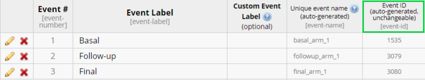

# REDCapDM

  
  

## **Introduction**

The REDCapDM package provides a comprehensive toolkit for managing data
exported from REDCap. It supports both importing REDCap data (from files
or via API), transforming and cleaning the data according to the
project’s dictionary and logic, and generating query reports for data
validation. In particular, REDCapDM can identify missing or out-of-range
values and track changes in identified queries across data versions.

  
  

## **Functions**

All main functions are listed below (and described in detail in the
examples):

### Import data

- [`redcap_data()`](https://bruigtp.github.io/REDCapDM/reference/redcap_data.md):
  Read REDCap data into R.

### Process data

- [`rd_dates()`](https://bruigtp.github.io/REDCapDM/reference/rd_dates.md):
  Standardize date and datetime fields.

- [`rd_delete_vars()`](https://bruigtp.github.io/REDCapDM/reference/rd_delete_vars.md):
  Remove specified variables (by name or pattern).

- [`rd_recalculate()`](https://bruigtp.github.io/REDCapDM/reference/rd_recalculate.md):
  Recompute calculated fields and compare with REDCap values.

- [`rd_factor()`](https://bruigtp.github.io/REDCapDM/reference/rd_factor.md):
  Replace numeric multiple-choice columns with their factor version.

- [`rd_checkbox()`](https://bruigtp.github.io/REDCapDM/reference/rd_checkbox.md):
  Expand checkbox responses with custom labels and rename `var___1`
  columns (REDCap style) to `var_option`.

- [`rd_split()`](https://bruigtp.github.io/REDCapDM/reference/rd_split.md):
  Split dataset by form or event.

- [`rd_insert_na()`](https://bruigtp.github.io/REDCapDM/reference/rd_insert_na.md):
  Manually set specified variables to missing based on a logical filter.

- [`rd_rlogic()`](https://bruigtp.github.io/REDCapDM/reference/rd_rlogic.md):
  Translate REDCap branching or calculation logic into R syntax.

- [`rd_dictionary()`](https://bruigtp.github.io/REDCapDM/reference/rd_dictionary.md):
  Update dictionary (translation of REDCap logic into R syntax) to
  reflect transformed data and logic.

Or we can use all these functions at once:

- [`rd_transform()`](https://bruigtp.github.io/REDCapDM/reference/rd_transform.md):
  One-step pipeline to clean and preprocess the raw REDCap data.

### Queries

- [`rd_query()`](https://bruigtp.github.io/REDCapDM/reference/rd_query.md):
  Apply expressions to identify data queries/issues.

- [`rd_event()`](https://bruigtp.github.io/REDCapDM/reference/rd_event.md):
  Report missing/incomplete events per record (longitudinal).

- [`check_queries()`](https://bruigtp.github.io/REDCapDM/reference/check_queries.md):
  Compare two query reports to track changes made.

- `rd_export`: Export query/report tables to an Excel (.xlsx) file.

  
  

## **Installation**

The release version can be installed from CRAN:

``` r

install.packages("REDCapDM")
```

The development version can be installed from GitHub:

``` r

install.packages("remotes") # Run this line if the 'remotes' package isn't installed already.
remotes::install_github("bruigtp/REDCapDM")
```

## **Built-in dataset**

For the following examples, we will use a random sample of the COVICAN
study which is included in the package. COVICAN is an international,
multicentre cohort study of cancer patients with COVID-19 to describe
the epidemiology, risk factors, and clinical outcomes of co-infections
and superinfections in onco-hematological patients with COVID-19.

We can load the built-in dataset by typing:

``` r

library(REDCapDM)

data(covican)
```

The structure of this dataset is:

    List of 3
     $ data      :'data.frame': 342 obs. of  56 variables:
     $ dictionary:'data.frame': 21 obs. of  18 variables:
     $ event_form:'data.frame': 9 obs. of  3 variables:

The first element in the list is a data frame containing all the data.
The second element is a data frame with the information in the
dictionary of the project about each field. The third and final element
is a data frame containing the correspondence of each event with each
form.

Some of the variables in the dataset are:

| Name | Description | Categories |
|:---|:---|:---|
| record_id | Identifier of each record |  |
| redcap_event_name | Auto-generated name of the events |  |
| redcap_data_access_group | Auto-generated name of each center |  |
| inc_1 | Patients older than 18 years | No ; Yes |
| inc_2 | Cancer patients | No ; Yes |
| inc_3 | Diagnosed of COVID-19 | No ; Yes |
| exc_1 | Solid tumour remission \>1 year | No ; Yes |
| screening_fail_crit | Indicator of non-compliance with inclusion and exclusion criteria | Compliance ; Non-compliance |
| d_birth | Date of birth (y-m-d) |  |
| d_admission | Date of first visit (y-m-d) |  |
| age | Age |  |
| dm | Indicator of diabetes | No ; Yes |
| type_dm | Type of diabetes | No complications ; End-organ diabetes-related disease |
| copd | Indicator of chronic pulmonary disease | No ; Yes |
| fio2 | Fraction of inspired oxygen (%) |  |
| available_analytics | Indicator of blood test available | No ; Yes |
| potassium | Potassium (mmol/L) |  |
| resp_rate | Respiratory rate (bpm) |  |
| leuk_lymph | Indicator of leukemia or lymphoma | No ; Yes |
| acute_leuk | Indicator of acute leukemia | No ; Yes |

  

## **Usage**

The package structure can be divided into three main components: reading
raw data, processing data and identifying queries. Typically, after
collecting data in REDCap, we will have to follow these three components
in order to have a final validated dataset for analysis. We will provide
a complete basic user guide on how to perform each one of these steps
using the package’s functions. For the processing of the data and query
identification, we will use the `covican` built-in dataset as an
example.

### **Read data**

#### **redcap_data**

The
[`redcap_data()`](https://bruigtp.github.io/REDCapDM/reference/redcap_data.md)
function allows users to easily import data from a REDCap project into
R.

In order to read exported data from REDCap, we first need to download
the data and dictionary from the REDCap project in R format. We can then
use the arguments `data_path` and `dic_path` to designate the local path
where we have stored the R file and the dictionary from the REDCap
project:

``` r

dataset <- redcap_data(data_path = "C:/Users/username/example.r",
                       dic_path = "C:/Users/username/example_dictionary.csv")
```

> Note: The R and data CSV file exported from REDCap must be located in
> the same directory.

If the REDCap project is longitudinal (contains more than one event)
then a third element should be specified with the correspondence of each
event with each form of the project. This csv file can be downloaded in
the REDCap of the project following these steps: *Project Setup* \<
*Designate Instruments for My Events* \< *Download instrument-event
mappings (CSV)*. Then, it has to be specified using the argument
`event_path`:

``` r

dataset <- redcap_data(data_path = "C:/Users/username/example.r",
                       dic_path = "C:/Users/username/example_dictionary.csv",
                       event_path = "C:/Users/username/events.csv")
```

> Note: if the project is longitudinal and the event-form file is not
> provided using the `event_path` argument, some steps of the
> processment can not be performed.

Another way to read data exported from a REDCap project is using an API
connection. To do this, we can use the arguments `uri` and `token` which
respectively refer to the uniform resource identifier of the REDCap
project and the user-specific string that serves as the password:

``` r

dataset_api <- redcap_data(uri = "https://redcap.idibell.cat/api/",
                           token = "55E5C3D1E83213ADA2182A4BFDEA")
```

In this case, there is no need to specify the event-form file since the
function will download it automatically using the API connection, if the
project is longitudinal.

> **Warning**: Please keep in mind that the API token gives you special
> access to the REDCap project and that it should not be shared with
> other people.

The
[`redcap_data()`](https://bruigtp.github.io/REDCapDM/reference/redcap_data.md)
function returns a list with three elements: imported data, dictionary
and event-form mapping(if included).

### **Process**

Given any data imported from REDCap with
[`redcap_data()`](https://bruigtp.github.io/REDCapDM/reference/redcap_data.md),
this would be the pipeline of an entire processing workflow:

``` r
data |> 
    rd_delete_vars(delete_pattern = c("_complete", "_timestamp") |>
    rd_dates() |>
    rd_recalculate() |> 
    rd_checkbox() |> 
    rd_factor() |> 
    rd_dictionary() |> 
    rd_split(by = "event") # use "form" if not longitudinal
```

All functions are optional and should only be used at the user’s
discretion when necessary. The order of some functions can also be
exchanged. For example, for `covican` there are no variables to delete
and dates are already processed, so the pipeline would be simplified:

``` r

covican_transformed <- covican |> 
    rd_recalculate() |> 
    rd_checkbox() |> 
    rd_factor() |> 
    rd_dictionary() |> 
    rd_split(by = "event") 

covican_transformed$results
#> 1. Recalculating calculated fields and saving them as '[field_name]_recalc'. (rd_recalculate)
#> 
#> 
#> | Total calculated fields | Non-transcribed fields | Recalculated different fields |
#> |:-----------------------:|:----------------------:|:-----------------------------:|
#> |            2            |         0 (0%)         |            1 (50%)            |
#> 
#> 
#> |     field_name      | Transcribed? | Is equal? |
#> |:-------------------:|:------------:|:---------:|
#> |         age         |     Yes      |   FALSE   |
#> | screening_fail_crit |     Yes      |   TRUE    |
#> 
#> 2. Transforming checkboxes: changing their values to No/Yes and changing their names to the names of its options. For checkboxes that have a branching logic, when the logic is missing their values will be set to missing. (rd_checkbox)
#> 
#> Table: Checkbox variables advisable to be reviewed
#> 
#> | Variables without any branching logic |
#> |:-------------------------------------:|
#> |        type_underlying_disease        |
#> 
#> 3. Replacing original variables for their factor version. (rd_factor)
#> 
#> 4. Converting every branching logic in the dictionary into R logic. (rd_dictionary)
#> 
#> 5. Final arrangment of the data by event. (rd_split)
```

All the functions that can be used in each step of a processing workflow
are detailed below:

#### **rd_delete_vars**

This function removes unwanted variables from both a REDCap dataset and
its dictionary. This is especially useful for eliminating automatically
generated fields such as form completion flags (`*_complete`) or
timestamps (`*_timestamp`).

You can delete variables either by specifying their exact names or by
using regular expression patterns:

``` r

# Option A: delete by variable name
covican_deleted <- covican |> 
  rd_delete_vars(vars = c("potassium", "leuk_lymph"))

# Option B: delete by regex pattern
covican_deleted <- covican |> 
  rd_delete_vars(pattern = c("_complete$", "_timestamp$"))
```

When variables are deleted:

- They are removed from both the dataset and dictionary.

- Factor versions of deleted variables (if present) are also removed.

  

#### **rd_dates**

This function is designed to process and standardize `date` and
`datetime` fields in a REDCap dataset. In REDCap projects, date and
datetime fields can sometimes be stored as character strings, which can
make analyses difficult. This function detects which fields should be
dates/datetimes from the REDCap dictionary and converts them to `Date`
and `POSIXct`, respectively.

``` r

covican_dates <- covican |> 
  rd_dates()
```

Quick verification example:

``` r

# Simulate a character date since covican already has the dates in the correct format
covican_dates <- covican
covican_dates$data <- covican_dates$data |> 
  dplyr::mutate(d_birth = as.character(d_birth))
# Check class before conversion

class(covican_dates$data$d_birth)
#> [1] "character"

# Check class after conversion
covican_dates <- covican_dates |> 
  rd_dates()
class(covican_dates$data$d_birth)
#> [1] "Date"
```

After this transformation, all `date` and `datetime` variables are
standardized and ready for analysis in R.

  

#### **rd_recalculate**

This function identifies calculated fields in a REDCap project,
translates their calculation logic into R, recalculates the values, and
compares the results with the values stored in REDCap.

It then produces a structured report that helps users detect
discrepancies between REDCap’s stored calculations and the values
recalculated in R.

``` r

covican_recalc <- covican |> 
  rd_recalculate()

# Print recalculation results
covican_recalc$results
```

    ## Recalculating calculated fields and saving them as '[field_name]_recalc'. (rd_recalculate)
    ## 
    ## 
    ## | Total calculated fields | Non-transcribed fields | Recalculated different fields |
    ## |:-----------------------:|:----------------------:|:-----------------------------:|
    ## |            2            |         0 (0%)         |            1 (50%)            |
    ## 
    ## 
    ## |     field_name      | Transcribed? | Is equal? |
    ## |:-------------------:|:------------:|:---------:|
    ## |         age         |     Yes      |   FALSE   |
    ## | screening_fail_crit |     Yes      |   TRUE    |

The `results` object includes:

- A summary report outlining the total number of calculated fields, how
  many were successfully transcribed into R, and how many showed
  differences between the REDCap values and the recalculated ones.

- A field-level report listing each calculated field, whether the logic
  was successfully converted to R, and whether the recalculated values
  match the originals.

You can also exclude specific fields from recalculation (e.g., complex
multi-event calculations) to reduce computation time and avoid
unnecessary warnings.

``` r

# Exclude specific variables from recalculation
covican_recalc <- covican |> 
  rd_recalculate(exclude = c("screening_fail_crit", "resp_rate"))

covican_recalc$results
```

    ## Recalculating calculated fields and saving them as '[field_name]_recalc'. (rd_recalculate)
    ## 
    ## 
    ## | Total calculated fields | Non-transcribed fields | Recalculated different fields |
    ## |:-----------------------:|:----------------------:|:-----------------------------:|
    ## |            1            |         0 (0%)         |           1 (100%)            |
    ## 
    ## 
    ## | field_name | Transcribed? | Is equal? |
    ## |:----------:|:------------:|:---------:|
    ## |    age     |     Yes      |   FALSE   |

After running this function:

- A new variable with the suffix `_recalc` is added to the dataset,
  placed immediately after the original variable and containing the
  recalculated values.

- The data dictionary is updated with a corresponding entry, where the
  original variable label is extended with `"(Recalculated)"` to make
  these fields easy to identify.

  

#### **rd_checkbox**

This function cleans and restructures REDCap checkbox fields. It
converts the default `"Unchecked/Checked"` categories of checkbox
responses created by REDCap into user-specified labels (default
`"No"/"Yes"`) and renames the `varname___code` variables (original
REDCap structure) to readable names based on the text of the checkbox
options. Additionally, it updates the dictionary to match the new
variable names. This includes choices, calculations, and branching
logic.

``` r

# Default transformation: "No"/"Yes" labels & renamed variables
cb <- covican |> 
  rd_checkbox()

str(cb$data$underlying_disease_hemato_acute_myeloid_leukemia)
```

    ##  num [1:342] 0 NA 0 NA 0 NA 0 NA 0 NA ...
    ##  - attr(*, "label")= chr "Specify underlying disease (choice=Acute myeloid leukemia)"

For example, consider the checkbox field of the type of underlying
disease present in the `covican` dataset. Originally, the variables were
named `type_underlying_disease__0` and `type_underlying_disease__1`,
while the option labels were ‘Haematological cancer’ and ‘Solid tumour’.
After running the function, the variables are renamed to
`type_underlying_disease_haematological_cancer` and
`type_underlying_disease_solid_tumour`, reflecting the option text in a
readable format..

To preserve the original REDCap-style names (e.g., `varname___1`,
`varname___2`) instead of renaming variables based on option text:

``` r

# use the argument checkbox_names to choose the final format of the variable names
cb <- covican |> 
  rd_checkbox(checkbox_names = FALSE)

str(cb$data$underlying_disease_hemato___1)
```

    ##  num [1:342] 0 NA 0 NA 0 NA 0 NA 0 NA ...
    ##  - attr(*, "label")= chr "Specify underlying disease (choice=Acute myeloid leukemia)"

If a checkbox field has a branching logic, the function will not modify
any values. However, you can use the `na_logic` argument, which accepts
the following options:

- `"none"` (default): do not set `NA` based on branching logic during
  transform.

- `"missing"`: set `NA` only where the branching logic evaluation is
  `NA`.

- `"eval"`: set `NA` where the branching logic evaluates to `FALSE`
  (i.e., logic not satisfied or missing).

``` r

cb <- covican |> 
  rd_checkbox(na_logic = "eval")
```

By default, checkbox factors are labeled `"No"` and `"Yes"`, but you can
specify alternative labels:

``` r

cb <- covican |> 
  rd_checkbox(checkbox_labels = c("Absent", "Present"))

str(cb$data$underlying_disease_hemato_acute_myeloid_leukemia)
```

    ##  num [1:342] 0 NA 0 NA 0 NA 0 NA 0 NA ...
    ##  - attr(*, "label")= chr "Specify underlying disease (choice=Acute myeloid leukemia)"

  

#### **rd_factor**

This function converts categorical variables in a REDCap dataset into R
factors by replacing each original variable (numeric version) with its
corresponding `.factor` version created by REDCap.

``` r

factored <- covican |> 
  rd_factor()

# Checking class of the variable
str(factored$data$available_analytics)
```

    ##  Factor w/ 2 levels "No","Yes": 2 2 2 2 2 1 2 NA 2 1 ...
    ##  - attr(*, "label")= chr "Blood test available? (+/- 72h)"

If you need to keep certain variables in their raw form, you can list
them in the `exclude` argument. This prevents those variables from being
replaced (including their `.factor` version) while still allowing the
rest of the dataset to be converted.

``` r

factored <- covican |> 
  rd_factor(exclude = c("available_analytics", "urine_culture"))

# Checking class of both versions of the variable
str(covican$data$available_analytics)
```

    ##  'labelled' int [1:342] 1 1 1 1 1 0 1 NA 1 0 ...
    ##  - attr(*, "label")= chr "Blood test available? (+/- 72h)"

``` r

str(covican$data$available_analytics.factor)
```

    ##  Factor w/ 2 levels "No","Yes": 2 2 2 2 2 1 2 NA 2 1 ...

> Note: the function automatically excludes these system variables from
> conversion: `redcap_event_name`, `redcap_repeat_instrument`,
> `redcap_data_access_group`. These variables are retained as-is to
> avoid interfering with longitudinal event mappings or user access
> groups.

After conversion only the cleaned factor variables remain in the
dataset, the original numeric version of those variables is dropped.

  

#### **rd_dictionary**

When working with REDCap exports, the data dictionary contains field
metadata, branching logic, and calculation rules written in REDCap
logic. The
[`rd_dictionary()`](https://bruigtp.github.io/REDCapDM/reference/rd_dictionary.md)
function refreshes branching logic and calculations, translating them
from REDCap logic into R logic, and ensures the dictionary remains
consistent with the cleaned dataset.

``` r

# Update dictionary after cleaning
dict_result <- covican |>
  rd_factor() |>
  rd_checkbox() |>
  rd_dictionary()
```

    ## Warning: The checkboxes are already in factor form. To properly evaluate
    ## checkbox branching logic, please run `rd_dictionary()` first.

When we transform the dictionary:

- Updates branching logic expressions so they match factor labels rather
  than numeric codes.

- Converts calculations and logic into R-friendly expressions.

- Reports any fields where branching logic or calculations could not be
  converted.

  

#### **rd_split**

After preparing your dataset, you may want to work with only one form or
one event at a time. The
[`rd_split()`](https://bruigtp.github.io/REDCapDM/reference/rd_split.md)
function separates your dataset accordingly.

- **By form**

For non-longitudinal projects (or longitudinal projects with an
`event_form` mapping), you can split the dataset into smaller datasets
based on forms.

``` r

forms_data <- covican |>
  rd_split(by = "form")

forms_data$data
```

    ## # A tibble: 7 × 3
    ##   form                        events    df             
    ##   <chr>                       <list>    <list>         
    ## 1 inclusionexclusion_criteria <chr [1]> <df [190 × 14]>
    ## 2 demographics                <chr [1]> <df [190 × 8]> 
    ## 3 comorbidities               <chr [1]> <df [190 × 15]>
    ## 4 cancer                      <chr [1]> <df [190 × 27]>
    ## 5 vital_signs                 <chr [2]> <df [342 × 7]> 
    ## 6 laboratory_findings         <chr [2]> <df [342 × 8]> 
    ## 7 microbiological_studies     <chr [1]> <df [190 × 7]>

If repeated entries exist, you can reshape the data into wide format:

``` r

forms_data <- covican |>
  rd_split(by = "form", wide = TRUE)
```

> Note: For longitudinal projects, the column events shows the number of
> events in each form.

- **By event**

For longitudinal projects, you can also split the data by event. The
function uses the `event_form` mapping to assign variables correctly to
each event:

``` r

events_data <- covican |>
  rd_split(by = "event")

events_data$data
```

    ## # A tibble: 2 × 2
    ##   events                   df             
    ##   <chr>                    <list>         
    ## 1 baseline_visit_arm_1     <df [190 × 56]>
    ## 2 follow_up_visit_da_arm_1 <df [152 × 10]>

If you want to extract only one form or event, use the `which` argument:

``` r

# Example by form
baseline_data <- covican |>
  rd_split(by = "form", which = "demographics")

head(baseline_data$data)
```

    ##   record_id    redcap_event_name redcap_data_access_group
    ## 1     100-6 baseline_visit_arm_1              hospital_11
    ## 2    100-13 baseline_visit_arm_1              hospital_11
    ## 3    100-16 baseline_visit_arm_1              hospital_11
    ## 4    100-31 baseline_visit_arm_1              hospital_11
    ## 5    100-34 baseline_visit_arm_1              hospital_11
    ## 6    100-36 baseline_visit_arm_1              hospital_11
    ##   redcap_event_name.factor redcap_data_access_group.factor    d_birth
    ## 1           Baseline visit                     Hospital 11 1963-10-05
    ## 2           Baseline visit                     Hospital 11 1959-10-04
    ## 3           Baseline visit                     Hospital 11 1951-04-08
    ## 4           Baseline visit                     Hospital 11 1944-08-08
    ## 5           Baseline visit                     Hospital 11 1954-12-02
    ## 6           Baseline visit                     Hospital 11 1952-05-08
    ##   d_admission age
    ## 1  2020-04-12  56
    ## 2  2020-02-13  60
    ## 3  2020-03-08  68
    ## 4  2020-02-23  75
    ## 5  2020-06-15  65
    ## 6  2020-02-25  67

  

#### **rd_insert_na**

This is an auxiliar/bonus function that can be used to set some values
of a variable(s) to missing if a certain logic is fulfilled. It can be
used, for example, to insert missings on those checkboxes that do not
have a branching logic, as mentioned earlier. For instance, we can
transform the checkboxes with the
[`rd_checkbox()`](https://bruigtp.github.io/REDCapDM/reference/rd_checkbox.md)
function and then use this function to set the values of the checkbox
*type_underlying_disease_haematological_cancer* to missing when the age
is less than 65 years old:

``` r

cb <- covican |> 
  rd_checkbox()

#Before inserting missings
table(cb$data$type_underlying_disease_haematological_cancer)
```


      0   1 
    103  87 

``` r

#Run with this function
cb2 <- covican |> 
  rd_checkbox() |> 
  rd_insert_na(vars = "type_underlying_disease_haematological_cancer",
               filter = "age < 65")

#After inserting missings
table(cb2$data$type_underlying_disease_haematological_cancer)
```


     0  1 
    65 50 

> Note that both the variable to be transformed (`age`) and the variable
> included in the filter
> (`type_underlying_disease_haematological_cancer`) are in the same
> event. If the variable to be transformed and the filter didn’t have
> any event in common then the transformation would give an error.
> Furthermore, if the variable to be transformed was in more events than
> the filter, only the rows of the events in common would be converted.

  

#### **rd_rlogic**

This is also an auxiliar/bonus function that transforms the REDCap logic
into logic that can be evaluated in R. It returns both the transformed
logic and the result of the evaluation of the logic in R. This function
is used internally in multiple functions, for example,
[`rd_dictionary()`](https://bruigtp.github.io/REDCapDM/reference/rd_dictionary.md).

> This function only returns the transformed logic, so it has to be used
> outside the transform workflow.

Let’s see how it transforms the logic of one of the calculated fields in
the built-in dataset:

``` r

logic_trans <- covican |> 
  rd_rlogic(logic = "if([exc_1]='1' or [inc_1]='0' or [inc_2]='0' or [inc_3]='0',1,0)",
            var = "screening_fail_crit")

str(logic_trans)
```

    List of 2
     $ rlogic: chr "ifelse(data$exc_1=='1' | data$inc_1=='0' | data$inc_2=='0' | data$inc_3=='0',1,0)"
     $ eval  : num [1:342] 0 NA 0 NA 0 NA 0 NA 0 NA ...

  

#### **rd_transform**

Alternatively, you can do all these steps at once using the
[`rd_transform()`](https://bruigtp.github.io/REDCapDM/reference/rd_transform.md)
function:

``` r

covican_transformed <- rd_transform(covican)

#Print the results of the transformation
covican_transformed$results
```

    1. Removing selected variables

    2. Deleting variables that contain some patterns

    3. Recalculating calculated fields and saving them as '[field_name]_recalc'


    | Total calculated fields | Non-transcribed fields | Recalculated different fields |
    |:-----------------------:|:----------------------:|:-----------------------------:|
    |            2            |         0 (0%)         |            1 (50%)            |


    |     field_name      | Transcribed? | Is equal? |
    |:-------------------:|:------------:|:---------:|
    |         age         |     Yes      |   FALSE   |
    | screening_fail_crit |     Yes      |   TRUE    |

    4. Transforming checkboxes: changing their values to No/Yes and changing their names to the names of its options.

    Table: Checkbox variables advisable to be reviewed

    | Variables without any branching logic |
    |:-------------------------------------:|
    |        type_underlying_disease        |

    5. Replacing original variables for their factor version

    6. Converting every branching logic in the dictionary into R logic

Using the arguments of the function we can perform all the different
type of transformations described until now.

### **Queries**

Queries are very important to ensure the accuracy and reliability of a
REDCap dataset. The collected data may contain missing values,
inconsistencies, or other potential errors that need to be identified in
order to correct them later.

For all the following examples we will use the raw transformed data:
`covican_transformed`.

#### **rd_query**

The
[`rd_query()`](https://bruigtp.github.io/REDCapDM/reference/rd_query.md)
function allows users to generate queries by using a specific
expression. It can be used to identify missing values, values that fall
outside the lower and upper limit of a variable and other types of
inconsistencies.

##### *Output*

First, we will examine the output of this function. When the
[`rd_query()`](https://bruigtp.github.io/REDCapDM/reference/rd_query.md)
function is executed, it returns a list that includes a data frame with
all the queries identified and a second element with a summary of the
number of generated queries in each specified variable for each
expression applied:

[TABLE]

| Variables | Description | Event | Query | Total |
|:--:|:--:|:--:|:--:|:--:|
| copd | Chronic obstructive pulmonary disease | Baseline visit | The value should not be missing | 6 |

Report of queries {.table .table .table-striped .table-condensed
style="width: auto !important; margin-left: auto; margin-right: auto;"}

The data frame is designed to aid users in locating each query in their
REDCap project. It includes information such as the record identifier,
the Data Access Group (DAG), the event in which each query can be found,
along with the name and the description of the analyzed variable and a
brief description of the query.

Let’s see some examples of the usability of the function in generating
different types of queries.

##### *Missings*

If we want to identify missing values in the variables *copd* and *age*
in the raw transformed data, a list of required arguments needs to be
supplied. We must use the `variables` argument to specify the variables
from the database that will be examined and the `expression` argument to
describe the expression that will be applied to those variables, in this
case ‘is.na(x)’ to detect missing values where x represents the variable
itself. Additionaly, we must use the `data` and `dic` arguments to
indicate the R objects containing the REDCap data and dictionary,
respectively. If the REDCap project presents a longitudinal design, we
should also specify the event in which the described variables are
present through the use of the `event` argument:

``` r

example <- rd_query(covican_transformed,
                    variables = c("copd", "age"),
                    expression = c("is.na(x)", "is.na(x)"),
                    event = "baseline_visit_arm_1")

# Printing results
example$results
```

| Variables | Description | Event | Query | Total |
|:--:|:--:|:--:|:--:|:--:|
| copd | Chronic obstructive pulmonary disease | Baseline visit | The value should not be missing | 6 |
| age | Age | Baseline visit | The value should not be missing | 5 |

Report of queries {.table .table .table-striped .table-condensed
style="width: auto !important; margin-left: auto; margin-right: auto;"}

In this case, we can observe that there are 6 missing values in the
*copd* variable and 5 missing values in *age*.

##### *Missings of variables with a branching logic*

Another example is when we try to identify missing values in variables
where a branching logic is employed. In this scenario, when the
conditions of the branching logic are not satisfied, by definition, all
of the values should be missing and thus queries for this specific
missing values (conditions not met) should not be reported. To adress
this, the function, when working with raw data, follows a two-step
process. Firstly, it transforms the branching logic associated with the
specified variable. Then, it applies this transformed logic during the
query generation process. However, if the dataset has already been
transformed using the
[`rd_transform()`](https://bruigtp.github.io/REDCapDM/reference/rd_transform.md)
function beforehand, the function will automatically apply the
previously transformed branching logic.

In both scenarios, if a variable contains branching logic that cannot be
converted from REDCap logic to R logic, the function will issue a
warning. The warning message will advise the user to review the
`results` element of the output for more information. This is to
indicate that there might be potential issues or limitations with the
conversion process for that specific variable’s branching logic:

``` r

example <- rd_query(covican_transformed,
                    variables = c("age", "copd", "potassium"),
                    expression = c("is.na(x)", "is.na(x)", "is.na(x)"),
                    event = "baseline_visit_arm_1")
```

    Warning: The branching logic of the following variables could not be converted into R logic: 
     - potassium
    Check the results element of the output(...$results) for details.

``` r

# Printing results
example$results
```

[TABLE]

Report of queries {.table .table .table-striped .table-condensed
style="width: auto !important; margin-left: auto; margin-right: auto;"}

Based on the information provided, in addition to the missing values of
the *age* and *copd* variables already identified, there are 31 missing
values in the *potassium* variable. The branching logic associated with
this variable, `[available_analytics][current-instance]=‘1’`, contains a
smart variable `[current-instance]`, which cannot be directly
transformed into R logic.

To address this issue and correctly identify missing values only when
*available_analytics* has the value *1*, the filter argument can be
utilized. By specifying the condition within the branching logic, you
can ensure that the filtering process fulfills this condition.

It is worth noting that during the transformation process, the value *1*
of the *available_analytics* variable was changed to *Yes* due to it
being a factor. Therefore, when implementing the filter, you need to
consider this transformed value rather than the original one. This
ensures that the condition is accurately applied and missing values are
appropriately identified based on the desired criteria.

``` r

example <- rd_query(covican_transformed,
                    variables = c("potassium"),
                    expression = c("is.na(x)"),
                    event = "baseline_visit_arm_1",
                    filter = c("available_analytics=='Yes'"))
```

    Warning: The branching logic of the following variables could not be converted into R logic: 
     - potassium
    Check the results element of the output(...$results) for details.

``` r

# Printing results
example$results
```

| Variables | Description | Event | Query | Total | Branching logic |
|:--:|:--:|:--:|:--:|:--:|:--:|
| potassium | Potassium | Baseline visit | The value should not be missing | 21 | \[available_analytics\]\[current-instance\]=‘1’ |

Report of queries {.table .table .table-striped .table-condensed
style="width: auto !important; margin-left: auto; margin-right: auto;"}

The total number of missing values changes when we use the `filter`
argument, the variable *potassium* now presents 21 missing values
instead of the previous 31 cases identified. This means that we were
identifying 10 missing values in which *available_analytics* did not
have the value *Yes* and, therefore, should not be considered as missing
values.

> Note: The `filter` argument is treated as a vector, which means that
> we can add a filter to each specified variable. Also, even if this
> argument is used to apply the branching logic condition, the warning
> about the presence of unconverted branching logic will still be
> displayed. In this specific case, you can safely ignore this warning.

##### *Expressions*

Up until this point, we have illustrated examples where the expression
applied is used to detect missing values. But, as previously mentioned,
the
[`rd_query()`](https://bruigtp.github.io/REDCapDM/reference/rd_query.md)
function is also able to identify outliers or observations that fulfill
a specific condition. Hence, to identify, for example, all the
observations where *age* is greater than 70, we should use the
`expression` argument again specifying ‘x\>70’:

``` r

example <- rd_query(variables="age",
                    expression="x>70",
                    event="baseline_visit_arm_1",
                    dic=covican_transformed$dictionary,
                    data=covican_transformed$data)

# Printing results
example$results
```

| Variables | Description | Event | Query | Total |
|:--:|:--:|:--:|:--:|:--:|
| age | Age | Baseline visit | The value should not be greater than 70 | 76 |

Report of queries {.table .table .table-striped .table-condensed
style="width: auto !important; margin-left: auto; margin-right: auto;"}

  

We can add other variables with other specific expressions in the same
function because it is designed to treat the arguments `variables` and
`expression` as vectors, so that the element at position *n* of
`expression` is applied to the element at position *n* of `variables`.

For example, if we want to identify all the observations where *age* is
greater than 70 and all the observations where *copd* is ‘Yes’ we shall
use:

``` r

example <- rd_query(covican_transformed,
                    variables=c("age", "copd"),
                    expression=c("x > 70", "x == 'Yes'"),
                    event="baseline_visit_arm_1")

# Printing results
example$results
```

| Variables | Description | Event | Query | Total |
|:--:|:--:|:--:|:--:|:--:|
| age | Age | Baseline visit | The value should not be greater than 70 | 76 |
| copd | Chronic obstructive pulmonary disease | Baseline visit | The value should not be equal to ‘Yes’ | 21 |

Report of queries {.table .table .table-striped .table-condensed
style="width: auto !important; margin-left: auto; margin-right: auto;"}

  

In a more complex scenario, for example, to identify all the
observations where *age* is greater than 70, less than 80, or it is a
missing value we shall use the following expression:

``` r

example <- rd_query(covican_transformed,
                    variables="age",
                    expression="(x>70 & x<80) | is.na(x)",
                    event="baseline_visit_arm_1")

# Printing results
example$results
```

| Variables | Description | Event | Query | Total |
|:--:|:--:|:--:|:--:|:--:|
| age | Age | Baseline visit | The value should not be (greater than 70 and less than 80) or missing | 54 |

Report of queries {.table .table .table-striped .table-condensed
style="width: auto !important; margin-left: auto; margin-right: auto;"}

##### *Special cases*

*Same expression for all variables*

In order to evaluate the same expression for all variables, the user
should supply just a single element for `expression`:

``` r

example <- rd_query(covican_transformed,
                    variables = c("copd","age","dm"),
                    expression = "is.na(x)",
                    event = "baseline_visit_arm_1")
```

    Warning: Number of variables (3) is greater than the number of expressions (1).
    The first expression will be applied to all variables.

``` r

# Printing results
example$results
```

| Variables | Description | Event | Query | Total |
|:--:|:--:|:--:|:--:|:--:|
| copd | Chronic obstructive pulmonary disease | Baseline visit | The value should not be missing | 6 |
| age | Age | Baseline visit | The value should not be missing | 5 |
| dm | Diabetes (treated with insulin or antidiabetic … | Baseline visit | The value should not be missing | 5 |

Report of queries {.table .table .table-striped .table-condensed
style="width: auto !important; margin-left: auto; margin-right: auto;"}

  

The function issues a warning every time the same expression is applied
to all variables to ensure that the user did not make a mistake when
providing the information for each argument.

  

*Not defining an event*

Another special case is when the data analysed corresponds to a REDCap
longitudinal project, but the event argument of the function is not
defined.

There are two possibilities here:

1.  *With event-form:* the function automatically detects in which
    events the variable is collected and generates queries for those
    events.

    ``` r

    example <- rd_query(covican_transformed,
                        variables = "copd",
                        expression = "is.na(x)")

    # Printing results
    example$results
    ```

    | Variables | Description | Event | Query | Total |
    |:--:|:--:|:--:|:--:|:--:|
    | copd | Chronic obstructive pulmonary disease | Baseline visit | The value should not be missing | 6 |

    Report of queries {.table .table .table-striped .table-condensed
    style="width: auto !important; margin-left: auto; margin-right: auto;"}

    We get the same result as if we had used the `event` argument.

2.  *Without event-form:* the function generates queries for all events
    present in the dataset.

    ``` r

    my_list <- subset(covican_transformed, !names(covican_transformed) %in% "event_form")

    example <- rd_query(my_list,
                        variables = "copd",
                        expression = "is.na(x)")
    ```

        Warning: No event or event-form has been specified. Therefore, the function
        will automatically consider observations from all events in the dataset. Ensure
        that the selected variable(s) is(are) collected in all specified events. This
        will avoid overestimating the number of queries.

    ``` r

    # Printing results
    example$results
    ```

    | Variables | Description | Event | Query | Total |
    |:--:|:--:|:--:|:--:|:--:|
    | copd | Chronic obstructive pulmonary disease | Follow up visit day 14+/-5d | The value should not be missing | 152 |
    | copd | Chronic obstructive pulmonary disease | Baseline visit | The value should not be missing | 6 |

    Report of queries {.table .table .table-striped .table-condensed
    style="width: auto !important; margin-left: auto; margin-right: auto;"}

    As we can see, there are 152 new missing values in the follow-up
    visit because the variable *copd* it is only present in the baseline
    visit. Thus, it might result in an overestimation of the number of
    missing values, as the function considers all the events of the
    study if no event is specified.

    The function will issue a warning if it detects that the REDCap
    project contains multiple events, the event-form mapping is not
    specified and the `event` argument is not specified.

  

##### *Additional arguments*

*variable_names, query_name, instrument*

These arguments allow users to customize the data frame returned by the
function. We can change the variables names using the `variables_names`
argument, alter the description of the query using the `query_name`
argument or even change the name of the instrument using the
`instrument` argument:

``` r

example<- rd_query(covican_transformed,
                   variables = c("copd"),
                   variables_names = c("Chronic obstructive pulmonary disease (Yes/No)"),
                   expression = c("is.na(x)"),
                   query_name = c("COPD is a missing value."),
                   instrument = c("Admission"),
                   event = "baseline_visit_arm_1")
```

Output:

[TABLE]

  

*negate*

This argument can be used to negate the expression applied to the
variables. For example, if we want to identify all the non missing
values of the variable *copd*, we can apply the expression ‘is.na(x)’
which normally would report the missing values and add `negate = TRUE`,
so the result will be the number of non missing values in *copd*:

``` r

example <- rd_query(covican_transformed,
                    variables = "copd",
                    expression = "is.na(x)",
                    negate = TRUE,
                    event = "baseline_visit_arm_1")

# Printing results
example$results
```

| Variables | Description | Event | Query | Total |
|:--:|:--:|:--:|:--:|:--:|
| copd | Chronic obstructive pulmonary disease | Baseline visit | The value should be missing | 184 |

Report of queries {.table .table .table-striped .table-condensed
style="width: auto !important; margin-left: auto; margin-right: auto;"}

There are 184 non missing values in the variable *copd*.

  

*addTo*

In order to keep all queries in the same R object, we can use the
`addTo` argument to specify the output of another query dataset.

``` r

example2 <- rd_query(covican_transformed,
                     variables = "age",
                     expression = "is.na(x)",
                     event = "baseline_visit_arm_1",
                     addTo = example)

# Printing results
example2$results
```

| Variables | Description | Event | Query | Total |
|:--:|:--:|:--:|:--:|:--:|
| copd | Chronic obstructive pulmonary disease | Baseline visit | The value should be missing | 184 |
| age | Age | Baseline visit | The value should not be missing | 5 |

Report of queries {.table .table .table-striped .table-condensed
style="width: auto !important; margin-left: auto; margin-right: auto;"}

We have joined our former output of 184 non missing values in the
variable *copd* with the new query dataset composed by the 5 missing
values of the variable *age*.

  

*report_title*

To customize the title of the summary of queries, we can use the
`report_title` argument:

``` r

example <- rd_query(covican_transformed,
                    variables = c("copd", "age"),
                    expression = c("is.na(x)", "x<20"),
                    event = "baseline_visit_arm_1",
                    report_title = "Missing COPD values in the baseline event")

# Printing results
example$results
```

| Variables | Description | Event | Query | Total |
|:--:|:--:|:--:|:--:|:--:|
| copd | Chronic obstructive pulmonary disease | Baseline visit | The value should not be missing | 6 |

Missing COPD values in the baseline event {.table .table .table-striped
.table-condensed
style="width: auto !important; margin-left: auto; margin-right: auto;"}

The default title of the summary is “Report of queries” but we have
changed it to “Missing COPD values in the baseline event”.

  

*report_zeros*

By default, the function will only report, in the summary of queries,
variables with at least one query and will omit those with zero queries.
To include these omitted variables in the summary, we can use the
`report_zeros` argument:

``` r

example <- rd_query(covican_transformed,
                    variables = c("copd", "age"),
                    expression = c("is.na(x)", "x < 20"),
                    event = "baseline_visit_arm_1",
                    report_zeros = TRUE)

# Printing results
example$results
```

| Variables | Description | Event | Query | Total |
|:--:|:--:|:--:|:--:|:--:|
| copd | Chronic obstructive pulmonary disease | Baseline visit | The value should not be missing | 6 |
| age | Age | Baseline visit | The value should not be less than 20 | 0 |

Report of queries {.table .table .table-striped .table-condensed
style="width: auto !important; margin-left: auto; margin-right: auto;"}

The variable *age* is reported in the summary in spite of not having any
queries identified.

  

*by_dag*

If the REDCap project has Data Access Groups (DAGs), it might be of our
interest to report the summary by each one of the DAGs. To do that, we
can use the `by_dag` argument:

``` r

example <- rd_query(covican_transformed,
                    variables = c("copd", "age"),
                    expression = c("is.na(x)", "x>60"),
                    event = "baseline_visit_arm_1",
                    by_dag = TRUE)
```

Now we can choose to see the report of a specific DAG, for example, the
summary of the generated queries for the *Hospital 2*:

``` r

# Printing results
example$results$`Hospital 2`
```

| DAG | Variables | Description | Event | Query | Total |
|:--:|:--:|:--:|:--:|:--:|:--:|
| Hospital 2 | age | Age | Baseline visit | The value should not be greater than 60 | 3 |
| Hospital 2 | copd | Chronic obstructive pulmonary disease | Baseline visit | The value should not be missing | 2 |

Report of queries {.table .table .table-striped .table-condensed
style="width: auto !important; margin-left: auto; margin-right: auto;"}

For this DAG, there are 3 values of *age* bigger than 60 and 2 missing
values in the variable *copd*.

  

*link*

There is an easier way to have access to each query in REDCap through
the output of the function. By using the `link` argument to specify the
domain, the REDCap version, the project ID and the event ID, the
function will add a column in the *\$queries* element of the output with
the direct link to REDCap where the query can be found.

> Note: The link will only work if the user has access to the project
> and has at least data viewing rights.

We can find the information about the domain, the REDCap version and the
project ID in the link of the *Project Home* of the project in REDCap:


The identifiers of the events can be exported from: *Project Setup* \<
*Define My Events*



Once we have this information, we pass it as a list to the `link`
argument:

``` r

example <- rd_query(covican_transformed,
                    variables = "age",
                    expression = "x>89",
                    event = "baseline_visit_arm_1",
                    link = list(domain = "redcappre.idibell.cat",
                                redcap_version = "13.1.9",
                                proj_id = 800,
                                event_id = c("baseline_visit_arm_1" = 811, "follow_up_visit_da_arm_1" = 812)))
```

The output of the function now has an additional column with the link to
the respective query:

``` r

# Printing results
example$queries$Link
```

    [1] "https://redcappre.idibell.cat/redcap_v13.1.9/DataEntry/index.php?pid=800&event_id=811&page=demographics&id=109-22"
    [2] "https://redcappre.idibell.cat/redcap_v13.1.9/DataEntry/index.php?pid=800&event_id=811&page=demographics&id=110-19"

We can go straight to the specific query by copying and pasting the link
into the web browser of your choice.

#### **rd_event**

When working with a longitudinal REDCap project (presence of events),
the exported data has a structure where each row represents one event
per record. However, by default, REDCap will not export the
corresponding rows of the events that have no collected data. So, if we
try to identify missing values in variables that are inside a missing
event for some records using the
[`rd_query()`](https://bruigtp.github.io/REDCapDM/reference/rd_query.md)
function, these missing values will not be identified because they do
not exist in the exported data. The
[`rd_event()`](https://bruigtp.github.io/REDCapDM/reference/rd_event.md)
function can be used to point out in how many records an event does not
exist:

``` r

example <- rd_event(covican_transformed,
                    event = "follow_up_visit_da_arm_1")

# Print results
example$results
```

|          Events          |         Description         | Total |
|:------------------------:|:---------------------------:|:-----:|
| follow_up_visit_da_arm_1 | Follow up visit day 14+/-5d |  38   |

Report of queries {.table .table .table-striped .table-condensed
style="width: auto !important; margin-left: auto; margin-right: auto;"}

There are a total of 38 events per record without any row corresponding
to the event *Follow up visit day 14+/-5d*. Thus, when searching for
missing values of variables in the *Follow up visit day 14+/-5d* event,
we need to consider that there will be 38 additional missing values
which will not be accounted for by
[`rd_query()`](https://bruigtp.github.io/REDCapDM/reference/rd_query.md).

  

It might happen that an event is not mandatory for all records so we
only want to check if the event is missing in a subgroup of records. For
example, in the *COVICAN* study only patients satisfying the inclusion
and exclusion criteria would have to perform the follow up visit.
Therefore, to check if the follow up event is missing only in the
records that fulfill the inclusion and exclusion criteria, we can use
the `filter` argument of the
[`rd_event()`](https://bruigtp.github.io/REDCapDM/reference/rd_event.md)
function:

``` r

example <- rd_event(covican_transformed,
                    event = "follow_up_visit_da_arm_1",
                    filter = "screening_fail_crit==0")

# Print results
example$results
```

|          Events          |         Description         | Total |
|:------------------------:|:---------------------------:|:-----:|
| follow_up_visit_da_arm_1 | Follow up visit day 14+/-5d |  34   |

Report of queries {.table .table .table-striped .table-condensed
style="width: auto !important; margin-left: auto; margin-right: auto;"}

  

Like the
[`rd_query()`](https://bruigtp.github.io/REDCapDM/reference/rd_query.md)
function, this function also treats the argument `event` as a vector
allowing us to check for multiple missing events at the same time.

``` r

example <- rd_event(covican_transformed,
                    event = c("baseline_visit_arm_1","follow_up_visit_da_arm_1"),
                    filter = "screening_fail_crit==0",
                    report_zeros = TRUE)

# Print results
example$results
```

|          Events          |         Description         | Total |
|:------------------------:|:---------------------------:|:-----:|
| follow_up_visit_da_arm_1 | Follow up visit day 14+/-5d |  34   |
|   baseline_visit_arm_1   |       Baseline visit        |   0   |

Report of queries {.table .table .table-striped .table-condensed
style="width: auto !important; margin-left: auto; margin-right: auto;"}

  

> Note: This function also has the arguments `query_name`, `addTo`,
> `report_title`, `report_zeros` and `link` that work in the same way as
> in the examples previously mentioned in section 4.3.1.6.

#### **check_queries**

Once the process of identifying queries is complete, the typical
approach would be to adress them by modifying the original dataset in
REDCap and re-run the query identification process generating a new
query dataset.

The
[`check_queries()`](https://bruigtp.github.io/REDCapDM/reference/check_queries.md)
function compares the previous query dataset with the new one by using
the arguments `old` and `new`, respectively. The output remains a list
with 2 items, but the data frame containing the information for each
query will now have an additional column (“Modification”) indicating
which queries are new, which have been modified, which have been
corrected, and which remain unchanged. Besides, the summary will show
the number of queries in each one of these categories:

``` r

check <- check_queries(old = example$queries, 
                       new = new_example$queries)

# Print results
check$results
```

|    State     | Total |
|:------------:|:-----:|
|   Pending    |   7   |
|    Solved    |   4   |
| Miscorrected |   1   |
|     New      |   1   |

Comparison report {.table .table .table-striped .table-condensed
style="width: auto !important; margin-left: auto; margin-right: auto;"}

There are 7 queries pending resolution, 4 solved queries, 1 miscorrected
query, and 1 new query between the previous and the new query dataset.

> Note: The “Miscorrected” category includes queries that belong to the
> same combination of record identifier and variable in both the old and
> new reports, but with a different reason. For instance, if a variable
> had a missing value in the old report, but in the new report shows a
> value outside the established range, it would be classified as
> “Miscorrected”.

  

Query control output:

[TABLE]

#### **rd_export**

With the help of the
[`rd_export()`](https://bruigtp.github.io/REDCapDM/reference/rd_export.md)
function, we can export the identified queries to a `.xlsx` file of our
choice:

``` r

rd_export(example)
```

This is the easiest way to use the function and it will create a file
with the name “example.xlsx” in your current working directory.

In order to have a more personalised output file, we can add information
to the following arguments:

``` r

rd_export(queries = example$queries,
          column = "Link",
          sheet_name = "Queries - Proyecto",
          path = "C:/User/Desktop/queries.xlsx",
          password = "123") 
```

We specify the sheet name with the `sheet_name` argument and the path to
the file to be exported with the `path` argument. To prevent anyone from
modifying the exported file, we can also add a password.

The `column` argument refers to the column of the report that contains
the link to each query. The function converts this column into hyperlink
format in the exported file, so that we can simply click on the link to
go to the specific query in the REDCap project.

In both cases, a message will be generated in the console informing you
that the file has been created and where it is located.
