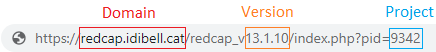

```{r message=FALSE, warning=FALSE, include=FALSE}
rm(list = ls())
library(REDCapDM) 
library(kableExtra)
library(knitr)
library(dplyr)
library(magrittr)
library(purrr)
```

<br>
<br>

# **Introduction**

The REDCapDM package allows users to read data exported directly from REDCap or via API connection. It also allows users to process the previously downloaded data, create reports of queries such as outliers or missing values and track the identified queries.

<br>
<br>

# **Functions**

Functions included in the package:

- `redcap_data()`: reads data.

- `rd_transform()`: processes data.

- `rd_rlogic()`: transforms REDCap logic into R logic.

- `rd_insert_na()`: allows a manual entry of a missing value in specific variables using a filter.

- `rd_query()`: identifies queries.

- `rd_event()`: identifies missing events.

- `check_queries()`: tracks queries.

<br>
<br>

# **Built-in dataset**

For the following examples, we will use a random sample of the COVICAN study which is included in the package. COVICAN is an international, multicentre cohort study of cancer patients with COVID-19 to describe the epidemiology, risk factors, and clinical outcomes of co-infections and superinfections in onco-hematological patients with COVID-19.

We can load the built-in dataset by typing:

```{r message=FALSE, warning=FALSE, comment=NA}
data(covican)
```

The structure of this dataset is:

```{r echo=FALSE, message=FALSE, warning=FALSE, comment=NA}
str(covican, max.level = 1)
```

The first element in the list is a data frame containing all the data. The second element is a data frame with the information in the dictionary of the project about each field. The third and final element is a data frame containing the correspondence of each event with each form.

Some of the variables in the dataset are:

```{r echo=FALSE, message=FALSE, warning=FALSE, comment=NA}
descr <- c("Identifier of each record", "",
           "Auto-generated name of the events", "",
           "Auto-generated name of each center", "",
           "Patients older than 18 years", "No ; Yes",
           "Cancer patients", "No ; Yes",
           "Diagnosed of COVID-19", "No ; Yes",
           "Solid tumour remission >1 year", "No ; Yes",
           "Indicator of non-compliance with inclusion and exclusion criteria", "Compliance ; Non-compliance",
           "Date of birth (y-m-d)", "",
           "Date of first visit (y-m-d)", "",
           "Age", "",
           "Indicator of diabetes", "No ; Yes",
           "Type of diabetes", "No complications ; End-organ diabetes-related disease",
           "Indicator of chronic pulmonary disease", "No ; Yes",
           "Fraction of inspired oxygen (%)", "",
           "Indicator of blood test available", "No ; Yes",
           "Potassium (mmol/L)", "",
           "Respiratory rate (bpm)", "",
           "Indicator of leukemia or lymphoma", "No ; Yes",
           "Indicator of acute leukemia", "No ; Yes")

vars <- data.frame("Name" = names(covican$data %>% dplyr::select(record_id:acute_leuk)),
                   "Description" = descr[seq(1, length(descr), 2)],
                   "Categories" = descr[seq(2, length(descr), 2)])

kable(vars) %>% 
  kableExtra::row_spec(0, bold=TRUE) %>% 
  kableExtra::kable_styling(full_width = F)
```

<br>

# **Examples**

The package structure can be divided into three main components: reading raw data, processing data and identifying queries. Typically, after collecting data in REDCap, we will have to follow this three components in order to have a final validated dataset for analysis. We will provide a complete user guide on how to perform each one of these steps using the package's functions. For the processing of the data and query identification, we will use the built-in dataset as an example.

## **Read data**

### **redcap_data**

The `redcap_data()` function allows users to easily import data from a REDCap project into R for analysis.

To read exported data from REDCap, use the arguments `data_path` and `dic_path` to, respectively, describe the path of the R file and the REDCap project's dictionary:

```{r message=FALSE, warning=FALSE, comment=NA, eval=FALSE}
dataset <- redcap_data(data_path = "C:/Users/username/example.r",
                       dic_path = "C:/Users/username/example_dictionary.csv")
```

Note: The R and CSV files exported from REDCap must be located in the same directory.

If the REDCap project is longitudinal (contains more than one event) then a third element should be specified with the correspondence of each event with each form of the project. This csv file can be downloaded in the REDCap of the project following these steps:  _Project Setup_ < _Designate Instruments for My Events_ < _Download instrument-event mappings (CSV)_.

```{r message=FALSE, warning=FALSE, comment=NA, eval=FALSE}
dataset <- redcap_data(data_path = "C:/Users/username/example.r",
                       dic_path = "C:/Users/username/example_dictionary.csv",
                       event_path = "C:/Users/username/events.csv")
```

Note: if the project is longitudinal and the event-form file is not provided using the `event_path` argument, some steps of the processment can not be performed.

Another way to read data exported from a REDCap project is using an API connection. To do this, we can use the arguments `uri` and `token` which respectively refer to the uniform resource identifier of the REDCap project and the user-specific string that serves as the password:

```{r eval=FALSE, message=FALSE, warning=FALSE, comment=NA}
dataset_api <- redcap_data(uri = "https://redcap.idibell.cat/api/",
                           token = "55E5C3D1E83213ADA2182A4BFDEA")
```

In this case, there is no need to specify the event-form file since the function will download it automatically using the API connection, if the project is longitudinal.

**Warning**: Please keep in mind that the API token gives you special access to the REDCap project and that it should not be shared with other people.

This function returns a list with 3 elements (imported data, dictionary and event-form mapping) which can then be used for further analysis or visualization. 

## **Process**

### **rd_transform**

The main function involved in the processing of the data is `rd_transform()`. This function is used to process the REDCap data read into R using the `redcap_data()`, as described above. Using the arguments of the function we can perform different type of transformations of our data.

As previously stated, we will use the built-in dataset `REDCapDM::covican` as an example.

#### *Data transformation*

The only necessary elements that must be provided are the dataset to be transformed and the corresponding dictionary. If the project is longitudinal, as in the case of `REDCapDM::covican`, also the event-form dataset should be specified. These elements can be specified directly using the output of the `redcap_data()` function or separately in different arguments.

```{r message=FALSE, warning=FALSE, comment=NA}
#Option A: list object 
covican_transformed <- rd_transform(covican)

#Option B: separately with different arguments
covican_transformed <- rd_transform(data = covican$data, 
                                    dic = covican$dictionary, 
                                    event_form = covican$event_form)

#Print the results of the transformation
covican_transformed$results
```

This function will return a list with the transformed dataset, dictionary, event_form and the output of the results of the transformation.

As we can see, there are several steps in the transformation:

<ol>
<li><u>Elimination of variables:</u> we can specify any variable in the dataset which we want to remove using the argument `delete_vars`, as explained later.</li>

<li><u>Elimination of variables containing some pattern:</u> by default, the pattern that the function looks for is '_complete' and '_timestamp'. We can specify any other pattern using the argument `delete_pattern`, as explained later.</li>

In this case, we do not have any variable with the pattern '_complete' and '_timestamp' since the built-in dataset only contains a sample of the variables of the project. All REDCap projects, when downloaded, contain one variable with the pattern '_complete' for each form indicating if the form has been marked as incomplete/unverified/completed. Also, if the project contains some survey then variables ending with '_timestamp' are also generated automatically. In general, we do not need this information so these variables are removed by default.

<li><u>Recalculation of REDCap calculated fields:</u> it finds all the calculated fields and recalculates them using the REDCap logic specified in the calculation field translated into R. The recalculated variable is saved as the original name adding '_recalc' at the end. It can happen that the logic found contains some specific smart-variables or other complex structures which the function is not able to transcribe. With the summary found in `results` we can see how many calculated fields have been found, if they have been transcribed and, if that is the case, if the recalculated variable is equal to the original one. </li>

Note: If the REDCap project is longitudinal and the event-form is not specified, this step will not be executed.

In the example, we can see how there are two REDCap calculated fields, both have been transcribed successfully and the recalculation of the age does not match the original calculated variable from REDCap.   

<li><u>Checkbox transformation:</u> by default, it changes the names of the checkboxes to the name of its corresponding option and the name of their labels to 'No/Yes'. If we want to specify another pair of label names we can specify them using the `checkbox_labels` argument as we will see. Furthermore, if the checkbox contains a branching logic, when this logic evaluated returns a missing value (some of the variables specified in it are missing) the values of the checkbox will be set to missing.</li>

Note: If the REDCap project is longitudinal and the event-form is not specified, the evaluations of the branching logic will not be done.

For example, let's explain the transformation that undergo the variables corresponding to the checkbox field of the type of underlying disease. The variables were named originally as _type_underlying_disease___0_ and _type_underlying_disease___1_ although the name of the options are 'Haematological cancer' and 'Solid tumour'. Thus, in the transformed dataset, the names are converted to _type_underlying_disease_haematological_cancer_ and _type_underlying_disease_solid_tumour_. Then, since this checkbox variable does not have a branching logic, the variable is advised to be reviewed by the user in the `results`, as seen above. When reviewed we could use an additional function `rd_insert_na()` to insert the necessary missing values into this variable, as we will explain later. If a branching logic was found for this variable, `rd_transform` will insert automatically the missing values when the logic is not satisfied and no further transformation will be needed.


<li><u>Replacement of the original variable by its factor version:</u> REDCap creates two versions of the variables in the dataset for multiple-choice fields: a numerical one with the number that corresponds to each category and a factor one containing the labels of each category. In this step, we will replace the original variables with their factor versions, except for _redcap_event_name_ and _redcap_data_access_group_, for which we will keep both versions. We can specify other variables that we do not want to transform to factor using the argument `exclude_to_factor` which we will see later.</li>

<li><u>Transformation of the branching logic:</u> by default, every branching logic contained in the dictionary is presented in REDCap logic. In this step, we will convert each branching logic into R logic in order to apply this information when needed. For example, we will use it to properly identify missing values in variables with a branching logic, as we will see later in the vignette.</li>


</ol>

#### *Data transformation and classification by event*

Additionally, we can change the final structure of the transformed dataset. For example, we can split it by each event. This can be done by specifying in the `final_format` argument that we want our data to be split by event. 

```{r message=FALSE, warning=FALSE, comment=NA}
dataset <- rd_transform(covican,
                        final_format = "by_event")

#To print the results
dataset$results
```

Now, a final step in the transformation has been added, which consists in splitting the data according to the events in the study. So, now the transformed dataset found in the output of the function is a tibble object with as many data frames as events there are in the REDCap project:

```{r message=FALSE, warning=FALSE, comment="#>", collapse = TRUE}
dataset$data
```

The column `df` of the nested dataframe is a list containing the data corresponding to each event. Also the variables of the forms that are found in each event are reported in the column `vars`.

Note: If the REDCap project is longitudinal and the event-form is not specified, this transformation is not posible.

#### *Data transformation and classification by form*

Another option is to split the data by the forms found in the REDCap project. We will use also the `final_format` argument to specify that we want to split data by form:

```{r message=FALSE, warning=FALSE, comment=NA}
dataset <- rd_transform(covican,
                        final_format = "by_form")

#To print the results
dataset$results
```

As before, a final step in the transformation has been added, which is to split the data according to the forms in the study. Thus, the transformed dataset will now be a tibble object with as many data frames as forms there are in the REDCap project:

```{r message=FALSE, warning=FALSE, comment="#>", collapse = TRUE}
dataset$data
```

Note: If the REDCap project is longitudinal and the event-form is not specified, this transformation is not posible.

#### *Additional arguments*

There are other arguments which can be used to customize some of the transformation steps that the function performs by default:

<br>

<u>checkbox_labels</u>: specifies the name of the categories for the checkbox variables. Default is 'No/Yes', but we can change it to 'N/Y':

```{r message=FALSE, warning=FALSE, comment=NA}
dataset <- rd_transform(covican,
                        checkbox_labels = c("N", "Y"))
```

<br>

<u>checkbox_na</u>: logical argument involved in the transformation of checkbox variables. For checkbox variables that have a branching logic specified, when the logic is missing the values of the checkbox will be always converted to missing. Additionally, if this argument is true then also when the branching logic isn't satisfied their values will be converted to missing.

```{r message=FALSE, warning=FALSE, comment=NA}
dataset <- rd_transform(covican,
                        checkbox_na = TRUE)
```

<br>

<u>exclude_recalc</u>: specifies the name of the variables that we do not want to be recalculated. For example, if we do not want to recalculate the variable _age_:

```{r message=FALSE, warning=FALSE, comment=NA}
dataset <- rd_transform(covican,
                        exclude_recalc = "age")
```

This argument is useful to reduce the time of execution of the function. For calculated fields with complex logic involving variables in different events the recalculation operation may be time consuming, so we can prevent the function to recalculate them with this argument.

<br>

<u>exclude_to_factor</u>: specifies the name of the variables that we do not want to transform into a factor. For example, if we want the variable _dm_ to keep its original numeric version:

```{r message=FALSE, warning=FALSE, comment=NA}
dataset <- rd_transform(covican,
                        exclude_to_factor = "dm")
```

<br>

<u>delete_vars</u>: every variable specified in this argument will be removed from the dataset. For example, we can change the argument to remove the date of birth variable from the dataset:

```{r message=FALSE, warning=FALSE, comment=NA}
dataset <- rd_transform(covican,
                        delete_vars = "d_birth")
```

<br>

<u>delete_pattern</u>: every variable containing the strings specified in this argument will be removed from the dataset. By default, the value of `delete_pattern` is '\_complete'. For example, we can change the argument to remove the inclusion and exclusion criteria variables from the dataset (variables that contain 'inc\_' and 'exc\_' in their names):

```{r message=FALSE, warning=FALSE, comment=NA}
dataset <- rd_transform(covican,
                        delete_pattern = c("inc_", "exc_"))
```

<br>

<u>which_event</u>: in the transformation by event explained earlier, we can specify whether we want to keep only one out of all the events in the dataset. For example, if we only want to keep the baseline visit:

```{r message=FALSE, warning=FALSE, comment=NA}
dataset <- rd_transform(covican,
                        final_format = "by_event",
                        which_event = "baseline_visit_arm_1")
```

<br>

<u>which_form</u>: in the transformation by form explained earlier, we can specify whether we want to keep only one of the forms. For example, if we only want to keep the demographic form:

```{r message=FALSE, warning=FALSE, comment=NA}

dataset <- rd_transform(covican,
                        final_format = "by_form",
                        which_form = "demographics")

data <- dataset$data

names(data)
```

<br>

<u>wide</u>: in the transformation by form, we can specify that we want each of the split datasets to be in a wide format. This is useful if the form appears in more than one event (or in a repeated event). Then, we will only have one row per patient and all the variables of the form will be in columns repeated by each event in the order that the events appear in REDCap. For example, if we want to keep only the laboratory findings in a wide format we can do:

```{r message=FALSE, warning=FALSE, comment="#>", collapse = TRUE}
dataset <- rd_transform(covican,
                        final_format = "by_form",
                        which_form = "laboratory_findings",
                        wide = TRUE)

head(dataset$data)
```

<br>

### **rd_rlogic**

This function transforms the REDCap logic into logic that can be evaluated in R. It returns both the transformed logic and the result of the evaluation of the logic. This function is used in the `rd_transform()` to recalculate the calculated fields and convert the branching logics, but it may also be useful to use it in other circunstances. Let's see how it transforms the logic of one of the calculated fields in the built-in dataset:

```{r message=FALSE, warning=FALSE, comment=NA}
logic_trans <- rd_rlogic(covican,
                         logic = "if([exc_1]='1' or [inc_1]='0' or [inc_2]='0' or [inc_3]='0',1,0)",
                         var = "screening_fail_crit")

str(logic_trans)
```

<br>

### **rd_insert_na**

This function sets some values of a variable to missing if a certain logic is fulfilled. It can be used as a complementary function for `rd_transform()`, for example, to change the values of those checkboxes that do not have a branching logic, as mentioned earlier. For instance, we can perform a raw transformation of our data, as in section 4.2.1.1, and then use this function to set the values of the checkbox _type_underlying_disease_haematological_cancer_ to missing when the age is less than 65 years old:

```{r message=FALSE, warning=FALSE, comment=NA}
#Raw transformation of the data:
dataset <- rd_transform(covican)

data <- dataset$data

#Before inserting missings
table(data$type_underlying_disease_haematological_cancer)

#Run the function
data2 <- rd_insert_na(dataset,
                      event_form = covican$event_form,
                      vars = "type_underlying_disease_haematological_cancer",
                      filter = "age < 65")

#After inserting missings
table(data2$type_underlying_disease_haematological_cancer)
```

Recall that both the variable to be transformed (_age_) and the variable included in the filter (_type_underlying_disease_haematological_cancer_) are in the same event. In the contrary, if the variable to be transformed and the filter didn't have any event in common then the transformation would give an error. Furthermore, if the variable to be transformed was in more events than the filter, only the rows of the events in common would be converted.

<br>

## **Queries**

Queries are very important to ensure the accuracy and reliability of a REDCap dataset. The collected data may contain missing values, inconsistencies, or other potential errors that need to be identified in order to correct them later.

For all the following examples we will use the raw transformed data: `covican_transformed`.

### **rd_query**

The `rd_query()` function allows users to generate queries by using a specific expression. It can be used to identify missing values, values that fall outside the lower and upper limit of a variable and other types of inconsistencies.

#### *Output*

First, we will examine the output of this function. When the `rd_query()` function is executed, it returns a list that includes a data frame with all the queries identified and a second element with a summary of the number of generated queries in each specified variable for each expression applied:

```{r message=FALSE, warning=FALSE, include=FALSE}
example <- rd_query(covican_transformed,
                    variables = "copd",
                    expression = "is.na(x)")
```

```{r echo=FALSE, message=FALSE, warning=FALSE, comment=NA}
kable(head(example$queries)) %>% 
  kableExtra::row_spec(0, bold = TRUE) %>% 
  kableExtra::kable_styling()

example$results
```

The data frame is designed to aid users in locating each query in their REDCap project. It includes information such as the record identifier, the Data Access Group (DAG), the event in which each query can be found, along with the name and the description of the analyzed variable and a brief description of the query.

Let's see some examples of the usability of the function in generating different types of queries.

#### *Missings*

If we want to identify missing values in the variables _copd_ and _age_ in the raw transformed data, a list of required arguments needs to be supplied. We must use the `variables` argument to specify the variables from the database that will be examined and the `expression` argument to describe the expression that will be applied to those variables, in this case 'is.na(x)' to detect missing values where x represents the variable itself. Additionaly, we must use the `data` and `dic` arguments to indicate the R objects containing the REDCap data and dictionary, respectively. If the REDCap project presents a longitudinal design, we should also specify the event in which the described variables are present through the use of the `event` argument:

```{r echo=TRUE, message=FALSE, warning=FALSE, comment=NA}
example <- rd_query(covican_transformed,
                    variables = c("copd", "age"),
                    expression = c("is.na(x)", "is.na(x)"),
                    event = "baseline_visit_arm_1")

# Printing results
example$results
```

In this case, we can observe that there are 6 missing values in the _copd_ variable and 5 missing values in _age_.

#### *Missings of variables with a branching logic*

Another example is when we try to identify missing values in variables where a branching logic is employed. In this scenario, when the conditions of the branching logic are not satisfied, by definition, all of the values should be missing and thus queries for this specific missing values (conditions not met) should not be reported. To adress this, the function, when working with raw data, follows a two-step process. Firstly, it transforms the branching logic associated with the specified variable. Then, it applies this transformed logic during the query generation process. However, if the dataset has already been transformed using the `rd_transform()` function beforehand, the function will automatically apply the previously transformed branching logic.

In both scenarios, if a variable contains branching logic that cannot be converted from REDCap logic to R logic, the function will issue a warning. The warning message will advise the user to review the `results` element of the output for more information. This is to indicate that there might be potential issues or limitations with the conversion process for that specific variable's branching logic:

```{r message=FALSE, warning=FALSE, include=FALSE}
covican_transformed$dictionary$branching_logic_show_field_only_if[covican_transformed$dictionary$field_name %in% "potassium"] <- "[available_analytics][current-instance]=‘1’"
```


```{r message=FALSE, warning=TRUE, comment=NA}
example <- rd_query(covican_transformed,
                    variables = c("age", "copd", "potassium"),
                    expression = c("is.na(x)", "is.na(x)", "is.na(x)"),
                    event = "baseline_visit_arm_1")

# Printing results
example$results
```

Based on the information provided, in addition to the missing values of the _age_ and _copd_ variables already identified, there are 31 missing values in the _potassium_ variable. The branching logic associated with this variable, `[available_analytics][current-instance]=‘1’`, contains a smart variable `[current-instance]`, which cannot be directly transformed into R logic. 

To address this issue and correctly identify missing values only when _available_analytics_ has the value _1_, the filter argument can be utilized. By specifying the condition within the branching logic, you can ensure that the filtering process fulfills this condition.

It is worth noting that during the transformation process, the value _1_ of the _available_analytics_ variable was changed to _Yes_ due to it being a factor. Therefore, when implementing the filter, you need to consider this transformed value rather than the original one. This ensures that the condition is accurately applied and missing values are appropriately identified based on the desired criteria.

```{r message=FALSE, warning=TRUE, comment=NA}
example <- rd_query(covican_transformed,
                    variables = c("potassium"),
                    expression = c("is.na(x)"),
                    event = "baseline_visit_arm_1",
                    filter = c("available_analytics=='Yes'"))

# Printing results
example$results
```

The total number of missing values changes when we use the `filter` argument, the variable _potassium_ now presents 21 missing values instead of the previous 31 cases identified. This means that we were identifying 10 missing values in which _available_analytics_ did not have the value _Yes_ and, therefore, should not be considered as missing values.

Note: The `filter` argument is treated as a vector, which means that we can add a filter to each specified variable. Also, even if this argument is used to apply the branching logic condition, the warning about the presence of unconverted branching logic will still be displayed. In this specific case, you can safely ignore this warning.

#### *Expressions*

Up until this point, we have illustrated examples where the expression applied is used to detect missing values. But, as previously mentioned, the `rd_query()` function is also able to identify outliers or observations that fulfill a specific condition. Hence, to identify, for example, all the observations where _age_ is greater than 70, we should use the `expression` argument again specifying 'x>70':


```{r message=FALSE, warning=TRUE, comment=NA}
example <- rd_query(variables="age",
                    expression="x>70",
                    event="baseline_visit_arm_1",
                    dic=covican_transformed$dictionary,
                    data=covican_transformed$data)

# Printing results
example$results
```

<br>

We can add other variables with other specific expressions in the same function because it is designed to treat the arguments `variables` and `expression` as vectors, so that the element at position _n_ of `expression` is applied to the element at position _n_ of `variables`.

For example, if we want to identify all the observations where _age_ is greater than 70 and all the observations where _copd_ is 'Yes' we shall use:

```{r message=FALSE, warning=TRUE, comment=NA}
example <- rd_query(covican_transformed,
                    variables=c("age", "copd"),
                    expression=c("x > 70", "x == 'Yes'"),
                    event="baseline_visit_arm_1")

# Printing results
example$results
```

<br>

In a more complex scenario, for example, to identify all the observations where _age_ is greater than 70, less than 80, or it is a missing value we shall use the following expression:

```{r message=FALSE, warning=TRUE, comment=NA}
example <- rd_query(covican_transformed,
                    variables="age",
                    expression="(x>70 & x<80) | is.na(x)",
                    event="baseline_visit_arm_1")

# Printing results
example$results
```

#### *Special cases*

<u>Same expression for all variables</u>

In order to evaluate the same expression for all variables, the user should supply just a single element for `expression`:

```{r message=FALSE, warning=TRUE, comment=NA}
example <- rd_query(covican_transformed,
                    variables = c("copd","age","dm"),
                    expression = "is.na(x)",
                    event = "baseline_visit_arm_1")

# Printing results
example$results
```

<br>

The function issues a warning every time the same expression is applied to all variables to ensure that the user did not make a mistake when providing the information for each argument.

<br>

<u>Not defining an event</u>

Another special case is when the data analysed corresponds to a REDCap longitudinal project, but the event argument of the function is not defined.

There are two possibilities here:

<ol>
<li><u>With event-form:</u> the function automatically detects in which events the variable is collected and generates queries for those events.</li>

```{r message=FALSE, warning=TRUE, comment=NA}
example <- rd_query(covican_transformed,
                    variables = "copd",
                    expression = "is.na(x)")

# Printing results
example$results
```

We get the same result as if we had used the `event` argument.


<li><u>Without event-form:</u> the function generates queries for all events present in the dataset.</li>

```{r message=FALSE, warning=TRUE, comment=NA}
my_list <- subset(covican_transformed, !names(covican_transformed) %in% "event_form")

example <- rd_query(my_list,
                    variables = "copd",
                    expression = "is.na(x)")

# Printing results
example$results
```

As we can see, there are 152 new missing values in the follow-up visit because the variable _copd_ it is only present in the baseline visit. Thus, it might result in an overestimation of the number of missing values, as the function considers all the events of the study if no event is specified. 


The function will issue a warning if it detects that the REDCap project contains multiple events, the event-form mapping is not specified and the `event` argument is not specified. 

</ol>

<br>

#### *Additional arguments*

<u>variable_names, query_name, instrument</u>

These arguments allow users to customize the data frame returned by the function. We can change the variables names using the `variables_names` argument, alter the description of the query using the `query_name` argument or even change the name of the instrument using the `instrument` argument:

```{r echo=TRUE, message=FALSE, warning=FALSE, comment=NA}
example<- rd_query(covican_transformed,
                   variables = c("copd"),
                   variables_names = c("Chronic obstructive pulmonary disease (Yes/No)"),
                   expression = c("is.na(x)"),
                   query_name = c("COPD is a missing value."),
                   instrument = c("Admission"),
                   event = "baseline_visit_arm_1")
```

Output:

```{r echo=FALSE, message=FALSE, warning=FALSE, comment=NA}
kable(example$queries[1,]) %>% kableExtra::row_spec(0,bold=TRUE) %>% kableExtra::kable_styling()
```

<br>

<u>negate</u>

This argument can be used to negate the expression applied to the variables. For example, if we want to identify all the non missing values of the variable _copd_, we can apply the expression 'is.na(x)' which normally would report the missing values and add `negate = TRUE`, so the result will be the number of non missing values in _copd_:

```{r message=FALSE, warning=FALSE, comment=NA}
example <- rd_query(covican_transformed,
                    variables = "copd",
                    expression = "is.na(x)",
                    negate = TRUE,
                    event = "baseline_visit_arm_1")

# Printing results
example$results
```

There are 184 non missing values in the variable _copd_.

<br>

<u>addTo</u>

In order to keep all queries in the same R object, we can use the `addTo` argument to specify the output of another query dataset.

```{r message=FALSE, warning=FALSE, comment=NA}
example2 <- rd_query(covican_transformed,
                     variables = "age",
                     expression = "is.na(x)",
                     event = "baseline_visit_arm_1",
                     addTo = example)

# Printing results
example2$results
```

We have joined our former output of 184 non missing values in the variable _copd_ with the new query dataset composed by the 5 missing values of the variable _age_.

<br>

<u>report_title</u>

To customize the title of the summary of queries, we can use the `report_title` argument:

```{r message=FALSE, warning=FALSE, comment=NA}
example <- rd_query(covican_transformed,
                    variables = c("copd", "age"),
                    expression = c("is.na(x)", "x<20"),
                    event = "baseline_visit_arm_1",
                    report_title = "Missing COPD values in the baseline event")

# Printing results
example$results
```

The default title of the summary is "Report of queries" but we have changed it to "Missing COPD values in the baseline event".

<br>

<u>report_zeros</u>

By default, the function will only report, in the summary of queries, variables with at least one query and will omit those with zero queries. To include these omitted variables in the summary, we can use the `report_zeros` argument:

```{r message=FALSE, warning=FALSE, comment=NA}
example <- rd_query(covican_transformed,
                    variables = c("copd", "age"),
                    expression = c("is.na(x)", "x < 20"),
                    event = "baseline_visit_arm_1",
                    report_zeros = TRUE)

# Printing results
example$results
```

The variable _age_ is reported in the summary in spite of not having any queries identified.

<br>

<u>by_dag</u>

If the REDCap project has Data Access Groups (DAGs), it might be of our interest to report the summary by each one of the DAGs. To do that, we can use the `by_dag` argument:

```{r message=FALSE, warning=FALSE, comment=NA}
example <- rd_query(covican_transformed,
                    variables = c("copd", "age"),
                    expression = c("is.na(x)", "x>60"),
                    event = "baseline_visit_arm_1",
                    by_dag = TRUE)
```

Now we can choose to see the report of a specific DAG, for example, the summary of the generated queries for the _Hospital 2_: 

```{r message=FALSE, warning=FALSE, comment=NA}
# Printing results
example$results$`Hospital 2`
```

For this DAG, there are 3 values of _age_ bigger than 60 and 2 missing values in the variable _copd_.

<br>

<u>link</u>

There is an easier way to have access to each query in REDCap through the output of the function. By using the `link` argument to specify the domain, the REDCap version, the project ID and the event ID, the function will add a column in the _$queries_ element of the output with the direct link to REDCap where the query can be found.

Note: The link will only work if the user has access to the project and has at least data viewing rights.

We can find the information about the domain, the REDCap version and the project ID in the link of the _Project Home_ of the project in REDCap:

```{r echo=FALSE, message=FALSE, warning=FALSE}

```

The identifiers of the events can be exported from: _Project Setup_ < _Define My Events_

```{r echo=FALSE, message=FALSE, warning=FALSE}
knitr::include_graphics("files/EventsID.png", dpi = 150)
```

Once we have this information, we pass it as a list to the `link` argument:

```{r message=FALSE, warning=FALSE, comment=NA}
example <- rd_query(covican_transformed,
                    variables = "age",
                    expression = "x>89",
                    event = "baseline_visit_arm_1",
                    link = list(domain = "redcappre.idibell.cat",
                                redcap_version = "13.1.9",
                                proj_id = 800,
                                event_id = c("baseline_visit_arm_1" = 811, "follow_up_visit_da_arm_1" = 812)))
```

The output of the function now has an additional column with the link to the respective query:

```{r message=FALSE, warning=FALSE, comment=NA}
# Printing results
example$queries$Link
```

We can go straight to the specific query by copying and pasting the link into the web browser of your choice.


### **rd_event**

When working with a longitudinal REDCap project (presence of events), the exported data has a structure where each row represents one event per record. However, by default, REDCap will not export the corresponding rows of the events that have no collected data. So, if we try to identify missing values in variables that are inside a missing event for some records using the `rd_query()` function, these missing values will not be identified because they do not exist in the exported data. The `rd_event()` function can be used to point out in how many records an event does not exist:

```{r message=FALSE, warning=FALSE, comment=NA}
example <- rd_event(covican_transformed,
                    event = "follow_up_visit_da_arm_1")

# Print results
example$results
```

There are a total of 38 events per record without any row corresponding to the event _Follow up visit day 14+/-5d_. Thus, when searching for missing values of variables in the _Follow up visit day 14+/-5d_ event, we need to consider that there will be 38 additional missing values which will not be accounted for by `rd_query()`.

<br>

It might happen that an event is not mandatory for all records so we only want to check if the event is missing in a subgroup of records. For example, in the _COVICAN_ study only patients satisfying the inclusion and exclusion criteria would have to perform the follow up visit. Therefore, to check if the follow up event is missing only in the records that fulfill the inclusion and exclusion criteria, we can use the `filter` argument of the `rd_event()` function:

```{r message=FALSE, warning=FALSE, comment=NA}
example <- rd_event(covican_transformed,
                    event = "follow_up_visit_da_arm_1",
                    filter = "screening_fail_crit==0")

# Print results
example$results
```

<br>

Like the `rd_query()` function, this function also treats the argument `event` as a vector allowing us to check for multiple missing events at the same time. 

```{r message=FALSE, warning=FALSE, comment=NA}
example <- rd_event(covican_transformed,
                    event = c("baseline_visit_arm_1","follow_up_visit_da_arm_1"),
                    filter = "screening_fail_crit==0",
                    report_zeros = TRUE)

# Print results
example$results
```

<br>

Note: This function also has the arguments `query_name`, `addTo`, `report_title`, `report_zeros` and `link` that work in the same way as in the examples previously mentioned in section 4.3.1.6.

### **check_queries**

Once the process of identifying queries is complete, the typical approach would be to adress them by modifying the original dataset in REDCap and re-run the query identification process generating a new query dataset.

The `check_queries()` function compares the previous query dataset with the new one by using the arguments `old` and `new`, respectively. The output remains a list with 2 items, but the data frame containing the information for each query will now have an additional column ("Modification") indicating which queries are new, which have been modified, which have been corrected, and which remain unchanged. Besides, the summary will show the number of queries in each one of these categories:

```{r message=FALSE, warning=FALSE, include=FALSE}
example <- rd_query(covican_transformed,
                    variables = c("copd", "age"),
                    expression = c("is.na(x)", "is.na(x)"),
                    event = "baseline_visit_arm_1")
new_example <- example
new_example$queries <- as.data.frame(new_example$queries)
new_example$queries <- new_example$queries[c(1:5, 10:11),] # We take only some of the previously created queries
new_example$queries[nrow(new_example$queries)+1,] <- c("100-79", "Hospital 11", "Baseline visit", "Comorbidities", "copd", "-", "Chronic obstructive pulmonary disease", "The value is NA and it should not be missing", "100-79-4") # we create a new query
new_example$queries[nrow(new_example$queries)+1,] <- c("105-56", "Hospital 5", "Baseline visit", "Demographics", "age", "-", "Age", "The value is 80 and it should not be >70", "105-56-2")
```


```{r message=FALSE, warning=FALSE, comment=NA}
check <- check_queries(old = example$queries, 
                       new = new_example$queries)

# Print results
check$results
```

There are 7 queries pending resolution, 4 solved queries, 1 miscorrected query, and 1 new query between the previous and the new query dataset.

Note: The "Miscorrected" category includes queries that belong to the same combination of record identifier and variable in both the old and new reports, but with a different reason. For instance, if a variable had a missing value in the old report, but in the new report shows a value outside the established range, it would be classified as "Miscorrected".

<br>

Query control output:

```{r echo=FALSE, message=FALSE, warning=FALSE, comment=NA}
example <- rbind(head(check$queries, 4), 
                 check$queries %>% dplyr::filter(Modification == "Modified") %>% dplyr::filter(row_number()==1))
kable(example) %>% kableExtra::row_spec(0,bold=TRUE) %>% kableExtra::kable_styling()
```


### **rd_export**

With the help of the `rd_export()` function, we can export the identified queries to a `.xlsx` file of our choice:

```{r message=FALSE, warning=FALSE, comment=NA, include=FALSE}
example <- rd_query(covican_transformed,
                    variables = c("copd", "age"),
                    expression = c("is.na(x)", "is.na(x)"),
                    event = "baseline_visit_arm_1")
```

```{r message=FALSE, warning=FALSE, comment=NA, eval=FALSE}
rd_export(example)
```

This is the easiest way to use the function and it will create a file with the name "example.xlsx" in your current working directory.

In order to have a more personalised output file, we can add information to the following arguments:

```{r message=FALSE, warning=FALSE, comment=NA, eval=FALSE}
rd_export(queries = example$queries,
          column = "Link",
          sheet_name = "Queries - Proyecto",
          path = "C:/User/Desktop/queries.xlsx",
          password = "123") 
```

We specify the sheet name with the `sheet_name` argument and the path to the file to be exported with the `path` argument. To prevent anyone from modifying the exported file, we can also add a password.

The `column` argument refers to the column of the report that contains the link to each query. The function converts this column into hyperlink format in the exported file, so that we can simply click on the link to go to the specific query in the REDCap project.

In both cases, a message will be generated in the console informing you that the file has been created and where it is located.
