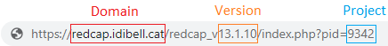

```{r message=FALSE, warning=FALSE, include=FALSE}
rm(list = ls())
library(REDCapDM) 
library(kableExtra)
library(knitr)
library(dplyr)
library(purrr)
```

<br>
<br>

# **Introduction**

The REDCapDM package provides a comprehensive toolkit for managing data exported from REDCap. It supports both importing REDCap data (from files or via API), transforming and cleaning the data according to the project’s dictionary and logic, and generating query reports for data validation. In particular, REDCapDM can identify missing or out-of-range values and track changes in identified queries across data versions. 

<br>
<br>

# **Functions**

All main functions are listed below (and described in detail in the examples):

## Import data

- `redcap_data()`: Read REDCap data into R.

## Process data

- `rd_dates()`: Standardize date and datetime fields.

- `rd_delete_vars()`: Remove specified variables (by name or pattern).

- `rd_recalculate()`: Recompute calculated fields and compare with REDCap values.

- `rd_factor()`: Replace numeric multiple-choice columns with their factor version.

- `rd_checkbox()`: Expand checkbox responses with custom labels and rename `var___1` columns (REDCap style) to `var_option`.

- `rd_split()`: Split dataset by form or event.

- `rd_insert_na()`: Manually set specified variables to missing based on a logical filter.

- `rd_rlogic()`: Translate REDCap branching or calculation logic into R syntax.

- `rd_dictionary()`: Update dictionary (translation of REDCap logic into R syntax) to reflect transformed data and logic.

Or we can use all these functions at once:

- `rd_transform()`: One-step pipeline to clean and preprocess the raw REDCap data.

## Queries

- `rd_query()`: Apply expressions to identify data queries/issues.

- `rd_event()`: Report missing/incomplete events per record (longitudinal).

- `check_queries()`: Compare two query reports to track changes made.

- `rd_export`: Export query/report tables to an Excel (.xlsx) file.

<br>
<br>

# **Built-in dataset**

For the following examples, we will use a random sample of the COVICAN study which is included in the package. COVICAN is an international, multicentre cohort study of cancer patients with COVID-19 to describe the epidemiology, risk factors, and clinical outcomes of co-infections and superinfections in onco-hematological patients with COVID-19.

We can load the built-in dataset by typing:

```{r message=FALSE, warning=FALSE, comment=NA}
data(covican)
```

The structure of this dataset is:

```{r echo=FALSE, message=FALSE, warning=FALSE, comment=NA}
str(covican, max.level = 1)
```

The first element in the list is a data frame containing all the data. The second element is a data frame with the information in the dictionary of the project about each field. The third and final element is a data frame containing the correspondence of each event with each form.

Some of the variables in the dataset are:

```{r echo=FALSE, message=FALSE, warning=FALSE, comment=NA}
descr <- c("Identifier of each record", "",
           "Auto-generated name of the events", "",
           "Auto-generated name of each center", "",
           "Patients older than 18 years", "No ; Yes",
           "Cancer patients", "No ; Yes",
           "Diagnosed of COVID-19", "No ; Yes",
           "Solid tumour remission >1 year", "No ; Yes",
           "Indicator of non-compliance with inclusion and exclusion criteria", "Compliance ; Non-compliance",
           "Date of birth (y-m-d)", "",
           "Date of first visit (y-m-d)", "",
           "Age", "",
           "Indicator of diabetes", "No ; Yes",
           "Type of diabetes", "No complications ; End-organ diabetes-related disease",
           "Indicator of chronic pulmonary disease", "No ; Yes",
           "Fraction of inspired oxygen (%)", "",
           "Indicator of blood test available", "No ; Yes",
           "Potassium (mmol/L)", "",
           "Respiratory rate (bpm)", "",
           "Indicator of leukemia or lymphoma", "No ; Yes",
           "Indicator of acute leukemia", "No ; Yes")

vars <- data.frame("Name" = names(covican$data |> dplyr::select(record_id:acute_leuk)),
                   "Description" = descr[seq(1, length(descr), 2)],
                   "Categories" = descr[seq(2, length(descr), 2)])

kable(vars) |> 
  kableExtra::row_spec(0, bold=TRUE) |> 
  kableExtra::kable_styling(full_width = F)
```

<br>

# **Usage**

The package structure can be divided into three main components: reading raw data, processing data and identifying queries. Typically, after collecting data in REDCap, we will have to follow this three components in order to have a final validated dataset for analysis. We will provide a complete basic user guide on how to perform each one of these steps using the package's functions. For the processing of the data and query identification, we will use the `covican` built-in dataset as an example.

## **Read data**

### **redcap_data**

The `redcap_data()` function allows users to easily import data from a REDCap project into R.

In order to read exported data from REDCap, we first need to download the data and dictionary from the REDCap project in R format. We can then use the arguments `data_path` and `dic_path` to designate the local path where we have stored the R file and the dictionary from the REDCap project:

```{r message=FALSE, warning=FALSE, comment=NA, eval=FALSE}
dataset <- redcap_data(data_path = "C:/Users/username/example.r",
                       dic_path = "C:/Users/username/example_dictionary.csv")
```

> Note: The R and data CSV file exported from REDCap must be located in the same directory.

If the REDCap project is longitudinal (contains more than one event) then a third element should be specified with the correspondence of each event with each form of the project. This csv file can be downloaded in the REDCap of the project following these steps:  _Project Setup_ < _Designate Instruments for My Events_ < _Download instrument-event mappings (CSV)_. Then, it has to be specified using the argument `event_path`:

```{r message=FALSE, warning=FALSE, comment=NA, eval=FALSE}
dataset <- redcap_data(data_path = "C:/Users/username/example.r",
                       dic_path = "C:/Users/username/example_dictionary.csv",
                       event_path = "C:/Users/username/events.csv")
```

> Note: if the project is longitudinal and the event-form file is not provided using the `event_path` argument, some steps of the processment can not be performed.

Another way to read data exported from a REDCap project is using an API connection. To do this, we can use the arguments `uri` and `token` which respectively refer to the uniform resource identifier of the REDCap project and the user-specific string that serves as the password:

```{r eval=FALSE, message=FALSE, warning=FALSE, comment=NA}
dataset_api <- redcap_data(uri = "https://redcap.idibell.cat/api/",
                           token = "55E5C3D1E83213ADA2182A4BFDEA")
```

In this case, there is no need to specify the event-form file since the function will download it automatically using the API connection, if the project is longitudinal.

> **Warning**: Please keep in mind that the API token gives you special access to the REDCap project and that it should not be shared with other people.

The `redcap_data()` function returns a list with three elements: imported data, dictionary and event-form mapping(if included).

## **Process**

Given any data imported from REDCap with `redcap_data()`, this would be the pipeline of an entire processing workflow:

```{r message=FALSE, warning=FALSE, eval = FALSE, comment="#>", collapse = TRUE}
data |> 
    rd_delete_vars(delete_pattern = c("_complete", "_timestamp") |>
    rd_dates() |>
    rd_recalculate() |> 
    rd_checkbox() |> 
    rd_factor() |> 
    rd_dictionary() |> 
    rd_split(by = "event") # use "form" if not longitudinal
```

All functions are optional and should only be used at the user's discretion when necessary. The order of some functions can also be exchanged. For example, for `covican` there are no variables to delete and dates are already processed, so the pipeline would be simplified:

```{r message=FALSE, warning=FALSE, comment="#>", collapse = TRUE}
covican_transformed <- covican |> 
    rd_recalculate() |> 
    rd_checkbox() |> 
    rd_factor() |> 
    rd_dictionary() |> 
    rd_split(by = "event") 

covican_transformed$results
```

All the functions that can be used in each step of a processing workflow are detailed below:

### **rd_delete_vars**

This function removes unwanted variables from both a REDCap dataset and its dictionary. This is especially useful for eliminating automatically generated fields such as form completion flags (`*_complete`) or timestamps (`*_timestamp`).

You can delete variables either by specifying their exact names or by using regular expression patterns:

```{r}
# Option A: delete by variable name
covican_deleted <- covican |> 
  rd_delete_vars(vars = c("potassium", "leuk_lymph"))

# Option B: delete by regex pattern
covican_deleted <- covican |> 
  rd_delete_vars(pattern = c("_complete$", "_timestamp$"))
```

When variables are deleted:

- They are removed from both the dataset and dictionary.

- Factor versions of deleted variables (if present) are also removed.

<br>


### **rd_dates**

This function is designed to process and standardize `date` and `datetime` fields in a REDCap dataset. In REDCap projects, date and datetime fields can sometimes be stored as character strings, which can make analyses difficult. It detects which fields should be dates/datetimes from the REDCap dictionary and converts them to `Date` and `POSIXct`, respectively.

```{r message=FALSE, warning=FALSE, comment="#>", collapse = TRUE}
covican_dates <- covican |> 
  rd_dates()
```

Quick verification example:

```{r message=FALSE, warning=FALSE, comment="#>", collapse = TRUE}
# Simulate a character date since covican already has the dates in the correct format
covican_dates <- covican
covican_dates$data <- covican_dates$data |> 
  dplyr::mutate(d_birth = as.character(d_birth))
# Check class before conversion

class(covican_dates$data$d_birth)

# Check class after conversion
covican_dates <- covican_dates |> 
  rd_dates()
class(covican_dates$data$d_birth)
```

After this transformation, all `date` and `datetime` variables are standardized and ready for analysis in R.

<br>

### **rd_recalculate**

This function identifies calculated fields in a REDCap project, translates their logic into R, recalculates them, and compares the recalculated values with the originals.  

It produces a report, helping users detect discrepancies between REDCap’s stored calculations and the values recomputed in R.

```{r}
covican_recalc <- covican |> 
  rd_recalculate()

# Print recalculation results
covican_recalc$results
```

_TODO: No pondría numeración cuando solo se corre esta función._

The `results` object contains:

- Summary report: total number of calculated fields, how many were successfully transcribed into R logic, and how many recalculated values differ from the originals.

- Field-level report: lists each calculated field, whether its logic was transcribed, and whether the recalculated value matches the original.

IN addition, you can exclude certain fields from recalculation (e.g., complex multi-event calculations) to reduce computation time and avoid unnecessary warnings.

```{r}
# Exclude specific variables from recalculation
covican_recalc <- covican |> 
  rd_recalculate(exclude_recalc = c("screening_fail_crit", "resp_rate"))

covican_recalc$results
```

_TODO: Cambiaria el nombre del argumento 'exclude_recalc' por 'exclude'_

When recalculation succeeds:

- A new variable is added to the dataset with the suffix `_recalc.`

- A corresponding entry is added to the dictionary with the label `". (Recalculate)"`.

_TODO: Valorar si las pondrías al final del diccionario o después de cada calc correspondiente_

<br>

### **rd_checkbox**

This function processes REDCap checkbox fields, converting them from "Checked"/"Unchecked" categories into binary-coded variables (0/1) and its corresponding factor variable with user-specified labels. It also renames variables to match checkbox option labels and updates dictionary branching logic accordingly.

```{r}
# Default transformation: "No"/"Yes" labels, renamed variables
cb <- covican |> 
  rd_checkbox()

str(cb$data$underlying_disease_hemato_acute_myeloid_leukemia)
```

If a branching logic exists for a checkbox field, the function attempts to translate it into R, by default. When `checkbox_na = TRUE`, values outside the branching logic are set to NA. A summary of problematic fields (e.g., missing branching logic or logic not transcribable) is included in the results element:

```{r}
cb$results
```

You can specify alternative labels:

```{r}
cb <- covican |> 
  rd_checkbox(checkbox_labels = c("Absent", "Present"))

str(cb$data$underlying_disease_hemato_acute_myeloid_leukemia)
```

To retain the original REDCap-style names (e.g., varname___1, varname___2) instead of renaming to option text:

```{r}
cb <- covican |> 
  rd_checkbox(checkbox_names = FALSE)

str(cb$data$underlying_disease_hemato___1)
```

<br>


### **rd_factor**

This function converts categorical variables in a REDCap dataset into R factors. It replaces categorical columns with the corresponding `.factor` column (created by REDCap for multiple-choice fields). It also updates the branching logic of the dictionary.

_TODO: Ojo, actualiza solo el branching logic o también el calculated? Lo mismo para las siguientes funciones. João ha mentido, no hace nada!! Quitarlo de todos los sitios en los que se dice (incluso documentación de las funciones)._

```{r}
factored <- covican |> 
  rd_factor()

# Checking class of the variable
str(factored$data$available_analytics)
```

You can prevent certain variables from being converted to factors using the `exclude` argument.
This is useful if you need to keep some variables as raw numeric or text data.

```{r}
factored <- covican |> 
  rd_factor(exclude = c("available_analytics", "urine_culture"))

# Checking class of the variable
str(covican$data$available_analytics)
```

> Note: the function automatically excludes these system variables from conversion: `redcap_event_name`, `redcap_repeat_instrument`, `redcap_data_access_group`. These variables are retained as-is to avoid interfering with longitudinal event mappings or user access groups.

After conversion, original variables are replaced with proper R factor columns and their `.factor` counterparts are dropped.

<br>

### **rd_dictionary**

When working with REDCap exports, the data dictionary contains field metadata, branching logic, and calculation rules written in REDCap logic. The `rd_dictionary()` function refreshes branching logic and calculations, translating them from REDCap logic into R logic, and ensures the dictionary remains consistent with the cleaned dataset.

```{r}
# Update dictionary after cleaning
dict_result <- covican |>
  rd_factor() |>
  rd_checkbox() |>
  rd_dictionary()
```

When we transform the dictionary:

- Updates branching logic expressions so they match factor labels rather than numeric codes.

- Converts calculations and logic into R-friendly expressions.

- Reports any fields where branching logic or calculations could not be converted.

<br>

### **rd_split**

After preparing your dataset, you may want to work with only one form or one event at a time. The `rd_split()` function separates your dataset accordingly.

> Note: For proper use of these functions, ensure that `rd_factor()` and `rd_checkbox()` have been applied to your dataset. If not, the function will emit an error and prompt you to run both functions first.

_TODO: valorar la posibilidad de aplicar el split en el caso que no se hayan aplicado estas funciones_

- **By form**

For non-longitudinal projects (or longitudinal projects with an `event_form` mapping), you can split the dataset into smaller datasets based on forms. If repeated entries exist, you can reshape the data into wide format:

```{r}
forms_data <- covican |>
  rd_factor() |>
  rd_checkbox() |>
  rd_split(by = "form")

forms_data$data
```

> Note: For longitudinal projects, the column events shows the number of events in each form.

- **By event**

For longitudinal projects, you can also split the data by event. The function uses the `event_form` mapping to assign variables correctly to each event:

```{r}
events_data <- covican |>
  rd_factor() |>
  rd_checkbox() |>
  rd_split(by = "event")

events_data$data
```

If you want to extract only one form or event, use the `which` argument:

```{r}
# Example by form
baseline_data <- covican |>
  rd_factor() |>
  rd_checkbox() |>
  rd_split(by = "form", which = "demographics")

head(baseline_data$data)
```

<br>

### **rd_insert_na**

This is a bonus function that can be used to set some values of a variable to missing if a certain logic is fulfilled. It can be used, for example, to insert missings on those checkboxes that do not have a branching logic, as mentioned earlier. For instance, we can transform the checkboxes with the `rd_checkbox()` function and then use this function to set the values of the checkbox _type_underlying_disease_haematological_cancer_ to missing when the age is less than 65 years old:

```{r message=FALSE, warning=FALSE, comment=NA}
cb <- covican |> 
  rd_checkbox()

#Before inserting missings
table(cb$data$type_underlying_disease_haematological_cancer)

#Run with this function
cb2 <- covican |> 
  rd_checkbox() |> 
  rd_insert_na(vars = "type_underlying_disease_haematological_cancer",
               filter = "age < 65")

#After inserting missings
table(cb2$data$type_underlying_disease_haematological_cancer)
```
_TODO: No funciona..._

> Recall that both the variable to be transformed (_age_) and the variable included in the filter (_type_underlying_disease_haematological_cancer_) are in the same event. In the contrary, if the variable to be transformed and the filter didn't have any event in common then the transformation would give an error. Furthermore, if the variable to be transformed was in more events than the filter, only the rows of the events in common would be converted.

<br>

### **rd_rlogic**

This is also a bonus function that transforms the REDCap logic into logic that can be evaluated in R. It returns both the transformed logic and the result of the evaluation of the logic in R. 

> This function only returns the transformed logic, so it has to be used outside the transform workflow.

Let's see how it transforms the logic of one of the calculated fields in the built-in dataset:

```{r message=FALSE, warning=FALSE, comment=NA}
logic_trans <- covican |> 
  rd_rlogic(logic = "if([exc_1]='1' or [inc_1]='0' or [inc_2]='0' or [inc_3]='0',1,0)",
            var = "screening_fail_crit")

str(logic_trans)
```

<br>

### **rd_transform**

Alternatively, you can do all these steps at once using the `rd_transform()` function:

```{r message=FALSE, warning=FALSE, comment=NA}
covican_transformed <- rd_transform(covican)

#Print the results of the transformation
covican_transformed$results
```

_TODO: Vigila que te sale otra vez un 1._

Using the arguments of the function we can perform all the different type of transformations described until now.

## **Queries**

Queries are very important to ensure the accuracy and reliability of a REDCap dataset. The collected data may contain missing values, inconsistencies, or other potential errors that need to be identified in order to correct them later.

For all the following examples we will use the raw transformed data: `covican_transformed`.

### **rd_query**

The `rd_query()` function allows users to generate queries by using a specific expression. It can be used to identify missing values, values that fall outside the lower and upper limit of a variable and other types of inconsistencies.

#### *Output*

First, we will examine the output of this function. When the `rd_query()` function is executed, it returns a list that includes a data frame with all the queries identified and a second element with a summary of the number of generated queries in each specified variable for each expression applied:

```{r message=FALSE, warning=FALSE, include=FALSE}
example <- rd_query(covican_transformed,
                    variables = "copd",
                    expression = "is.na(x)")
```

```{r echo=FALSE, message=FALSE, warning=FALSE, comment=NA}
kable(head(example$queries)) |> 
  kableExtra::row_spec(0, bold = TRUE) |> 
  kableExtra::kable_styling()

example$results
```

The data frame is designed to aid users in locating each query in their REDCap project. It includes information such as the record identifier, the Data Access Group (DAG), the event in which each query can be found, along with the name and the description of the analyzed variable and a brief description of the query.

Let's see some examples of the usability of the function in generating different types of queries.

#### *Missings*

If we want to identify missing values in the variables _copd_ and _age_ in the raw transformed data, a list of required arguments needs to be supplied. We must use the `variables` argument to specify the variables from the database that will be examined and the `expression` argument to describe the expression that will be applied to those variables, in this case 'is.na(x)' to detect missing values where x represents the variable itself. Additionaly, we must use the `data` and `dic` arguments to indicate the R objects containing the REDCap data and dictionary, respectively. If the REDCap project presents a longitudinal design, we should also specify the event in which the described variables are present through the use of the `event` argument:

```{r echo=TRUE, message=FALSE, warning=FALSE, comment=NA}
example <- rd_query(covican_transformed,
                    variables = c("copd", "age"),
                    expression = c("is.na(x)", "is.na(x)"),
                    event = "baseline_visit_arm_1")

# Printing results
example$results
```

In this case, we can observe that there are 6 missing values in the _copd_ variable and 5 missing values in _age_.

#### *Missings of variables with a branching logic*

Another example is when we try to identify missing values in variables where a branching logic is employed. In this scenario, when the conditions of the branching logic are not satisfied, by definition, all of the values should be missing and thus queries for this specific missing values (conditions not met) should not be reported. To adress this, the function, when working with raw data, follows a two-step process. Firstly, it transforms the branching logic associated with the specified variable. Then, it applies this transformed logic during the query generation process. However, if the dataset has already been transformed using the `rd_transform()` function beforehand, the function will automatically apply the previously transformed branching logic.

In both scenarios, if a variable contains branching logic that cannot be converted from REDCap logic to R logic, the function will issue a warning. The warning message will advise the user to review the `results` element of the output for more information. This is to indicate that there might be potential issues or limitations with the conversion process for that specific variable's branching logic:

```{r message=FALSE, warning=FALSE, include=FALSE}
covican_transformed$dictionary$branching_logic_show_field_only_if[covican_transformed$dictionary$field_name %in% "potassium"] <- "[available_analytics][current-instance]=‘1’"
```


```{r message=FALSE, warning=TRUE, comment=NA}
example <- rd_query(covican_transformed,
                    variables = c("age", "copd", "potassium"),
                    expression = c("is.na(x)", "is.na(x)", "is.na(x)"),
                    event = "baseline_visit_arm_1")

# Printing results
example$results
```

Based on the information provided, in addition to the missing values of the _age_ and _copd_ variables already identified, there are 31 missing values in the _potassium_ variable. The branching logic associated with this variable, `[available_analytics][current-instance]=‘1’`, contains a smart variable `[current-instance]`, which cannot be directly transformed into R logic. 

To address this issue and correctly identify missing values only when _available_analytics_ has the value _1_, the filter argument can be utilized. By specifying the condition within the branching logic, you can ensure that the filtering process fulfills this condition.

It is worth noting that during the transformation process, the value _1_ of the _available_analytics_ variable was changed to _Yes_ due to it being a factor. Therefore, when implementing the filter, you need to consider this transformed value rather than the original one. This ensures that the condition is accurately applied and missing values are appropriately identified based on the desired criteria.

```{r message=FALSE, warning=TRUE, comment=NA}
example <- rd_query(covican_transformed,
                    variables = c("potassium"),
                    expression = c("is.na(x)"),
                    event = "baseline_visit_arm_1",
                    filter = c("available_analytics=='Yes'"))

# Printing results
example$results
```

The total number of missing values changes when we use the `filter` argument, the variable _potassium_ now presents 21 missing values instead of the previous 31 cases identified. This means that we were identifying 10 missing values in which _available_analytics_ did not have the value _Yes_ and, therefore, should not be considered as missing values.

> Note: The `filter` argument is treated as a vector, which means that we can add a filter to each specified variable. Also, even if this argument is used to apply the branching logic condition, the warning about the presence of unconverted branching logic will still be displayed. In this specific case, you can safely ignore this warning.

#### *Expressions*

Up until this point, we have illustrated examples where the expression applied is used to detect missing values. But, as previously mentioned, the `rd_query()` function is also able to identify outliers or observations that fulfill a specific condition. Hence, to identify, for example, all the observations where _age_ is greater than 70, we should use the `expression` argument again specifying 'x>70':


```{r message=FALSE, warning=TRUE, comment=NA}
example <- rd_query(variables="age",
                    expression="x>70",
                    event="baseline_visit_arm_1",
                    dic=covican_transformed$dictionary,
                    data=covican_transformed$data)

# Printing results
example$results
```

<br>

We can add other variables with other specific expressions in the same function because it is designed to treat the arguments `variables` and `expression` as vectors, so that the element at position _n_ of `expression` is applied to the element at position _n_ of `variables`.

For example, if we want to identify all the observations where _age_ is greater than 70 and all the observations where _copd_ is 'Yes' we shall use:

```{r message=FALSE, warning=TRUE, comment=NA}
example <- rd_query(covican_transformed,
                    variables=c("age", "copd"),
                    expression=c("x > 70", "x == 'Yes'"),
                    event="baseline_visit_arm_1")

# Printing results
example$results
```

<br>

In a more complex scenario, for example, to identify all the observations where _age_ is greater than 70, less than 80, or it is a missing value we shall use the following expression:

```{r message=FALSE, warning=TRUE, comment=NA}
example <- rd_query(covican_transformed,
                    variables="age",
                    expression="(x>70 & x<80) | is.na(x)",
                    event="baseline_visit_arm_1")

# Printing results
example$results
```

#### *Special cases*

<u>Same expression for all variables</u>

In order to evaluate the same expression for all variables, the user should supply just a single element for `expression`:

```{r message=FALSE, warning=TRUE, comment=NA}
example <- rd_query(covican_transformed,
                    variables = c("copd","age","dm"),
                    expression = "is.na(x)",
                    event = "baseline_visit_arm_1")

# Printing results
example$results
```

<br>

The function issues a warning every time the same expression is applied to all variables to ensure that the user did not make a mistake when providing the information for each argument.

<br>

<u>Not defining an event</u>

Another special case is when the data analysed corresponds to a REDCap longitudinal project, but the event argument of the function is not defined.

There are two possibilities here:

<ol>
<li><u>With event-form:</u> the function automatically detects in which events the variable is collected and generates queries for those events.</li>

```{r message=FALSE, warning=TRUE, comment=NA}
example <- rd_query(covican_transformed,
                    variables = "copd",
                    expression = "is.na(x)")

# Printing results
example$results
```

We get the same result as if we had used the `event` argument.


<li><u>Without event-form:</u> the function generates queries for all events present in the dataset.</li>

```{r message=FALSE, warning=TRUE, comment=NA}
my_list <- subset(covican_transformed, !names(covican_transformed) %in% "event_form")

example <- rd_query(my_list,
                    variables = "copd",
                    expression = "is.na(x)")

# Printing results
example$results
```

As we can see, there are 152 new missing values in the follow-up visit because the variable _copd_ it is only present in the baseline visit. Thus, it might result in an overestimation of the number of missing values, as the function considers all the events of the study if no event is specified. 


The function will issue a warning if it detects that the REDCap project contains multiple events, the event-form mapping is not specified and the `event` argument is not specified. 

</ol>

<br>

#### *Additional arguments*

<u>variable_names, query_name, instrument</u>

These arguments allow users to customize the data frame returned by the function. We can change the variables names using the `variables_names` argument, alter the description of the query using the `query_name` argument or even change the name of the instrument using the `instrument` argument:

```{r echo=TRUE, message=FALSE, warning=FALSE, comment=NA}
example<- rd_query(covican_transformed,
                   variables = c("copd"),
                   variables_names = c("Chronic obstructive pulmonary disease (Yes/No)"),
                   expression = c("is.na(x)"),
                   query_name = c("COPD is a missing value."),
                   instrument = c("Admission"),
                   event = "baseline_visit_arm_1")
```

Output:

```{r echo=FALSE, message=FALSE, warning=FALSE, comment=NA}
kable(example$queries[1,]) |> kableExtra::row_spec(0,bold=TRUE) |> kableExtra::kable_styling()
```

<br>

<u>negate</u>

This argument can be used to negate the expression applied to the variables. For example, if we want to identify all the non missing values of the variable _copd_, we can apply the expression 'is.na(x)' which normally would report the missing values and add `negate = TRUE`, so the result will be the number of non missing values in _copd_:

```{r message=FALSE, warning=FALSE, comment=NA}
example <- rd_query(covican_transformed,
                    variables = "copd",
                    expression = "is.na(x)",
                    negate = TRUE,
                    event = "baseline_visit_arm_1")

# Printing results
example$results
```

There are 184 non missing values in the variable _copd_.

<br>

<u>addTo</u>

In order to keep all queries in the same R object, we can use the `addTo` argument to specify the output of another query dataset.

```{r message=FALSE, warning=FALSE, comment=NA}
example2 <- rd_query(covican_transformed,
                     variables = "age",
                     expression = "is.na(x)",
                     event = "baseline_visit_arm_1",
                     addTo = example)

# Printing results
example2$results
```

We have joined our former output of 184 non missing values in the variable _copd_ with the new query dataset composed by the 5 missing values of the variable _age_.

<br>

<u>report_title</u>

To customize the title of the summary of queries, we can use the `report_title` argument:

```{r message=FALSE, warning=FALSE, comment=NA}
example <- rd_query(covican_transformed,
                    variables = c("copd", "age"),
                    expression = c("is.na(x)", "x<20"),
                    event = "baseline_visit_arm_1",
                    report_title = "Missing COPD values in the baseline event")

# Printing results
example$results
```

The default title of the summary is "Report of queries" but we have changed it to "Missing COPD values in the baseline event".

<br>

<u>report_zeros</u>

By default, the function will only report, in the summary of queries, variables with at least one query and will omit those with zero queries. To include these omitted variables in the summary, we can use the `report_zeros` argument:

```{r message=FALSE, warning=FALSE, comment=NA}
example <- rd_query(covican_transformed,
                    variables = c("copd", "age"),
                    expression = c("is.na(x)", "x < 20"),
                    event = "baseline_visit_arm_1",
                    report_zeros = TRUE)

# Printing results
example$results
```

The variable _age_ is reported in the summary in spite of not having any queries identified.

<br>

<u>by_dag</u>

If the REDCap project has Data Access Groups (DAGs), it might be of our interest to report the summary by each one of the DAGs. To do that, we can use the `by_dag` argument:

```{r message=FALSE, warning=FALSE, comment=NA}
example <- rd_query(covican_transformed,
                    variables = c("copd", "age"),
                    expression = c("is.na(x)", "x>60"),
                    event = "baseline_visit_arm_1",
                    by_dag = TRUE)
```

Now we can choose to see the report of a specific DAG, for example, the summary of the generated queries for the _Hospital 2_: 

```{r message=FALSE, warning=FALSE, comment=NA}
# Printing results
example$results$`Hospital 2`
```

For this DAG, there are 3 values of _age_ bigger than 60 and 2 missing values in the variable _copd_.

<br>

<u>link</u>

There is an easier way to have access to each query in REDCap through the output of the function. By using the `link` argument to specify the domain, the REDCap version, the project ID and the event ID, the function will add a column in the _$queries_ element of the output with the direct link to REDCap where the query can be found.

> Note: The link will only work if the user has access to the project and has at least data viewing rights.

We can find the information about the domain, the REDCap version and the project ID in the link of the _Project Home_ of the project in REDCap:

```{r echo=FALSE, message=FALSE, warning=FALSE}

```

The identifiers of the events can be exported from: _Project Setup_ < _Define My Events_

```{r echo=FALSE, message=FALSE, warning=FALSE}
knitr::include_graphics("files/EventsID.png", dpi = 150)
```

Once we have this information, we pass it as a list to the `link` argument:

```{r message=FALSE, warning=FALSE, comment=NA}
example <- rd_query(covican_transformed,
                    variables = "age",
                    expression = "x>89",
                    event = "baseline_visit_arm_1",
                    link = list(domain = "redcappre.idibell.cat",
                                redcap_version = "13.1.9",
                                proj_id = 800,
                                event_id = c("baseline_visit_arm_1" = 811, "follow_up_visit_da_arm_1" = 812)))
```

The output of the function now has an additional column with the link to the respective query:

```{r message=FALSE, warning=FALSE, comment=NA}
# Printing results
example$queries$Link
```

We can go straight to the specific query by copying and pasting the link into the web browser of your choice.


### **rd_event**

When working with a longitudinal REDCap project (presence of events), the exported data has a structure where each row represents one event per record. However, by default, REDCap will not export the corresponding rows of the events that have no collected data. So, if we try to identify missing values in variables that are inside a missing event for some records using the `rd_query()` function, these missing values will not be identified because they do not exist in the exported data. The `rd_event()` function can be used to point out in how many records an event does not exist:

```{r message=FALSE, warning=FALSE, comment=NA}
example <- rd_event(covican_transformed,
                    event = "follow_up_visit_da_arm_1")

# Print results
example$results
```

There are a total of 38 events per record without any row corresponding to the event _Follow up visit day 14+/-5d_. Thus, when searching for missing values of variables in the _Follow up visit day 14+/-5d_ event, we need to consider that there will be 38 additional missing values which will not be accounted for by `rd_query()`.

<br>

It might happen that an event is not mandatory for all records so we only want to check if the event is missing in a subgroup of records. For example, in the _COVICAN_ study only patients satisfying the inclusion and exclusion criteria would have to perform the follow up visit. Therefore, to check if the follow up event is missing only in the records that fulfill the inclusion and exclusion criteria, we can use the `filter` argument of the `rd_event()` function:

```{r message=FALSE, warning=FALSE, comment=NA}
example <- rd_event(covican_transformed,
                    event = "follow_up_visit_da_arm_1",
                    filter = "screening_fail_crit==0")

# Print results
example$results
```

<br>

Like the `rd_query()` function, this function also treats the argument `event` as a vector allowing us to check for multiple missing events at the same time. 

```{r message=FALSE, warning=FALSE, comment=NA}
example <- rd_event(covican_transformed,
                    event = c("baseline_visit_arm_1","follow_up_visit_da_arm_1"),
                    filter = "screening_fail_crit==0",
                    report_zeros = TRUE)

# Print results
example$results
```

<br>

> Note: This function also has the arguments `query_name`, `addTo`, `report_title`, `report_zeros` and `link` that work in the same way as in the examples previously mentioned in section 4.3.1.6.

### **check_queries**

Once the process of identifying queries is complete, the typical approach would be to adress them by modifying the original dataset in REDCap and re-run the query identification process generating a new query dataset.

The `check_queries()` function compares the previous query dataset with the new one by using the arguments `old` and `new`, respectively. The output remains a list with 2 items, but the data frame containing the information for each query will now have an additional column ("Modification") indicating which queries are new, which have been modified, which have been corrected, and which remain unchanged. Besides, the summary will show the number of queries in each one of these categories:

```{r message=FALSE, warning=FALSE, include=FALSE}
example <- rd_query(covican_transformed,
                    variables = c("copd", "age"),
                    expression = c("is.na(x)", "is.na(x)"),
                    event = "baseline_visit_arm_1")
new_example <- example
new_example$queries <- as.data.frame(new_example$queries)
new_example$queries <- new_example$queries[c(1:5, 10:11),] # We take only some of the previously created queries
new_example$queries[nrow(new_example$queries)+1,] <- c("100-79", "Hospital 11", "Baseline visit", "Comorbidities", "copd", "-", "Chronic obstructive pulmonary disease", "The value is NA and it should not be missing", "100-79-4") # we create a new query
new_example$queries[nrow(new_example$queries)+1,] <- c("105-56", "Hospital 5", "Baseline visit", "Demographics", "age", "-", "Age", "The value is 80 and it should not be >70", "105-56-2")
```


```{r message=FALSE, warning=FALSE, comment=NA}
check <- check_queries(old = example$queries, 
                       new = new_example$queries)

# Print results
check$results
```

There are 7 queries pending resolution, 4 solved queries, 1 miscorrected query, and 1 new query between the previous and the new query dataset.

> Note: The "Miscorrected" category includes queries that belong to the same combination of record identifier and variable in both the old and new reports, but with a different reason. For instance, if a variable had a missing value in the old report, but in the new report shows a value outside the established range, it would be classified as "Miscorrected".

<br>

Query control output:

```{r echo=FALSE, message=FALSE, warning=FALSE, comment=NA}
example <- rbind(head(check$queries, 4), 
                 check$queries |> dplyr::filter(Modification == "Modified") |> dplyr::filter(row_number()==1))
kable(example) |> kableExtra::row_spec(0,bold=TRUE) |> kableExtra::kable_styling()
```


### **rd_export**

With the help of the `rd_export()` function, we can export the identified queries to a `.xlsx` file of our choice:

```{r message=FALSE, warning=FALSE, comment=NA, include=FALSE}
example <- rd_query(covican_transformed,
                    variables = c("copd", "age"),
                    expression = c("is.na(x)", "is.na(x)"),
                    event = "baseline_visit_arm_1")
```

```{r message=FALSE, warning=FALSE, comment=NA, eval=FALSE}
rd_export(example)
```

This is the easiest way to use the function and it will create a file with the name "example.xlsx" in your current working directory.

In order to have a more personalised output file, we can add information to the following arguments:

```{r message=FALSE, warning=FALSE, comment=NA, eval=FALSE}
rd_export(queries = example$queries,
          column = "Link",
          sheet_name = "Queries - Proyecto",
          path = "C:/User/Desktop/queries.xlsx",
          password = "123") 
```

We specify the sheet name with the `sheet_name` argument and the path to the file to be exported with the `path` argument. To prevent anyone from modifying the exported file, we can also add a password.

The `column` argument refers to the column of the report that contains the link to each query. The function converts this column into hyperlink format in the exported file, so that we can simply click on the link to go to the specific query in the REDCap project.

In both cases, a message will be generated in the console informing you that the file has been created and where it is located.
